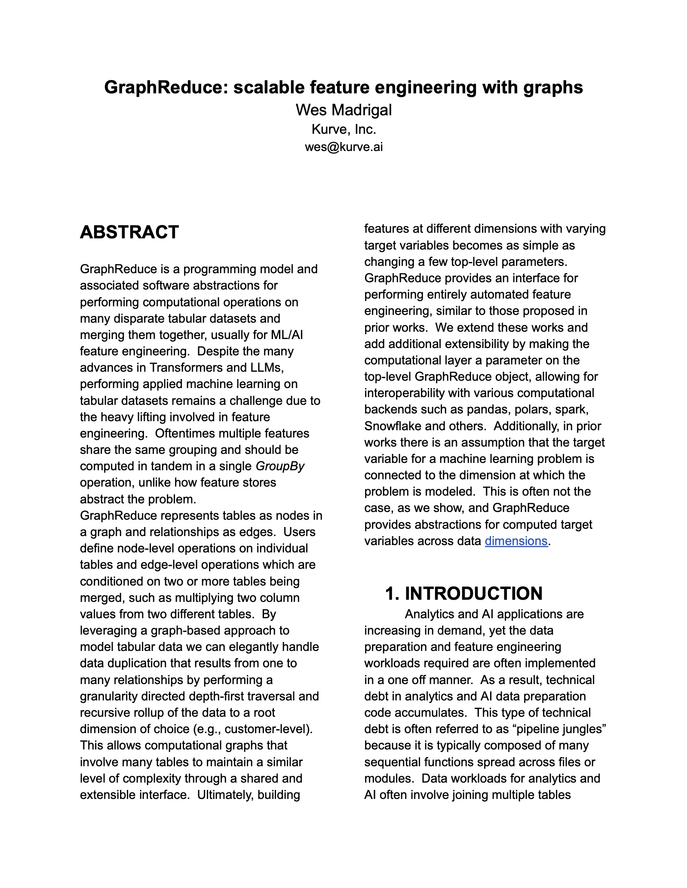

# GraphReduce


## Description
GraphReduce is an abstraction for building machine learning feature
engineering pipelines that involve many tables in a composable way.
The library is intended to help bridge the gap between research feature
definitions and production deployment without the overhead of a full 
feature store.  Underneath the hood, GraphReduce uses graph data
structures to represent tables/files as nodes and foreign keys
as edges.

Compute backends supported: `pandas`, `dask`, `spark`, AWS Athena, Redshift, Snowflake, postgresql, MySQL
Compute backends coming soon: `ray`


### Installation
```python
# from pypi
pip install graphreduce

# from github
pip install 'graphreduce@git+https://github.com/wesmadrigal/graphreduce.git'

# install from source
git clone https://github.com/wesmadrigal/graphreduce && cd graphreduce && python setup.py install
```


## Motivation
Machine learning requires [vectors of data](https://arxiv.org/pdf/1212.4569.pdf), but our tabular datasets
are disconnected.  They can be represented as a graph, where tables
are nodes and join keys are edges.  In many model building scenarios
there isn't a nice ML-ready vector waiting for us, so we must curate
the data by joining many tables together to flatten them into a vector.
This is the problem `graphreduce` sets out to solve.  

## Prior work
* [Deep Feature Synthesis](https://www.maxkanter.com/papers/DSAA_DSM_2015.pdf
)
* [One Button Machine (IBM)](One Button Machine (IBM))
* [autofeat (BASF)](http://arxiv.org/pdf/1901.07329)
* [featuretools (inspired by Deep Feature Synthesis)](https://github.com/alteryx/featuretools)

## Shortcomings of prior work
* point in time correctness is not always handled well
* Deep Feature Synthesis and `featuretools` are limited to `pandas` and a couple of SQL databases
* One Button Machine from IBM uses `spark` but their implementation outside of the paper could not be found
* none of the prior implementations allow for custom computational graphs or additional third party libraries

## We extend prior works and add the following functionality:
* point in time correctness on arbitrarily large computational graphs
* extensible computational layers, with support currently spanning: `pandas`, `dask`, `spark`, AWS Athena, AWS Redshift, Snowflake, postgresql, mysql, and more coming
* customizable node implementations for a mix of dynamic and custom feature engineering with the ability to use third party libraries for portions (e.g., [cleanlab](https://github.com/cleanlab/cleanlab) for cleaning)


## To get this example schema ready for an ML model we need to do the following:
* define the node-level interface and operations for filtering, annotating, normalizing, and reducing
* select the [granularity](https://en.wikipedia.org/wiki/Granularity#Data_granularity)) to which we'll reduce our data: in this example `customer` 
* specify how much historical data will be included and what holdout period will be used (e.g., 365 days of historical data and 1 month of holdout data for labels)
* filter all data entities to include specified amount of history to prevent [data leakage](https://en.wikipedia.org/wiki/Leakage_(machine_learning))
* depth first, bottom up aggregation operations group by / aggregation operations to reduce data


1. End to end example:
```python
import datetime
import pandas as pd
from graphreduce.node import GraphReduceNode, DynamicNode
from graphreduce.enum import ComputeLayerEnum, PeriodUnit
from graphreduce.graph_reduce import GraphReduce

# source from a csv file with the relationships
# using the file at: https://github.com/wesmadrigal/GraphReduce/blob/master/examples/cust_graph_labels.csv
reldf = pd.read_csv('cust_graph_labels.csv')

# using the data from: https://github.com/wesmadrigal/GraphReduce/tree/master/tests/data/cust_data
files = {
    'cust.csv' : {'prefix':'cu'},
    'orders.csv':{'prefix':'ord'},
    'order_products.csv': {'prefix':'op'},
    'notifications.csv':{'prefix':'notif'},
    'notification_interactions.csv':{'prefix':'ni'},
    'notification_interaction_types.csv':{'prefix':'nit'}

}
# create graph reduce nodes
gr_nodes = {
    f.split('/')[-1]: DynamicNode(
        fpath=f,
        fmt='csv',
        pk='id',
        prefix=files[f]['prefix'],
        date_key=None,
        compute_layer=GraphReduceComputeLayerEnum.pandas,
        compute_period_val=730,
        compute_period_unit=PeriodUnit.day,
    )
    for f in files.keys()
}
gr = GraphReduce(
    name='cust_dynamic_graph',
    parent_node=gr_nodes['cust.csv'],
    fmt='csv',
    cut_date=datetime.datetime(2023,9,1),
    compute_layer=GraphReduceComputeLayerEnum.pandas,
    auto_features=True,
    auto_feature_hops_front=1,
    auto_feature_hops_back=2,
    label_node=gr_nodes['orders.csv'],
    label_operation='count',
    label_field='id',
    label_period_val=60,
    label_period_unit=PeriodUnit.day
)
# Add graph edges
for ix, row in reldf.iterrows():
    gr.add_entity_edge(
        parent_node=gr_nodes[row['to_name']],
        relation_node=gr_nodes[row['from_name']],
        parent_key=row['to_key'],
        relation_key=row['from_key'],
        reduce=True
    )


gr.do_transformations()
2024-04-23 13:49:41 [info     ] hydrating graph attributes
2024-04-23 13:49:41 [info     ] hydrating attributes for DynamicNode
2024-04-23 13:49:41 [info     ] hydrating attributes for DynamicNode
2024-04-23 13:49:41 [info     ] hydrating attributes for DynamicNode
2024-04-23 13:49:41 [info     ] hydrating attributes for DynamicNode
2024-04-23 13:49:41 [info     ] hydrating attributes for DynamicNode
2024-04-23 13:49:41 [info     ] hydrating attributes for DynamicNode
2024-04-23 13:49:41 [info     ] hydrating graph data
2024-04-23 13:49:41 [info     ] checking for prefix uniqueness
2024-04-23 13:49:41 [info     ] running filters, normalize, and annotations for <GraphReduceNode: fpath=notification_interaction_types.csv fmt=csv>
2024-04-23 13:49:41 [info     ] running filters, normalize, and annotations for <GraphReduceNode: fpath=notification_interactions.csv fmt=csv>
2024-04-23 13:49:41 [info     ] running filters, normalize, and annotations for <GraphReduceNode: fpath=notifications.csv fmt=csv>
2024-04-23 13:49:41 [info     ] running filters, normalize, and annotations for <GraphReduceNode: fpath=orders.csv fmt=csv>
2024-04-23 13:49:41 [info     ] running filters, normalize, and annotations for <GraphReduceNode: fpath=order_products.csv fmt=csv>
2024-04-23 13:49:41 [info     ] running filters, normalize, and annotations for <GraphReduceNode: fpath=cust.csv fmt=csv>
2024-04-23 13:49:41 [info     ] depth-first traversal through the graph from source: <GraphReduceNode: fpath=cust.csv fmt=csv>
2024-04-23 13:49:41 [info     ] reducing relation <GraphReduceNode: fpath=notification_interactions.csv fmt=csv>
2024-04-23 13:49:41 [info     ] performing auto_features on node <GraphReduceNode: fpath=notification_interactions.csv fmt=csv>
2024-04-23 13:49:41 [info     ] joining <GraphReduceNode: fpath=notification_interactions.csv fmt=csv> to <GraphReduceNode: fpath=notifications.csv fmt=csv>
2024-04-23 13:49:41 [info     ] reducing relation <GraphReduceNode: fpath=notifications.csv fmt=csv>
2024-04-23 13:49:41 [info     ] performing auto_features on node <GraphReduceNode: fpath=notifications.csv fmt=csv>
2024-04-23 13:49:41 [info     ] joining <GraphReduceNode: fpath=notifications.csv fmt=csv> to <GraphReduceNode: fpath=cust.csv fmt=csv>
2024-04-23 13:49:41 [info     ] reducing relation <GraphReduceNode: fpath=order_products.csv fmt=csv>
2024-04-23 13:49:41 [info     ] performing auto_features on node <GraphReduceNode: fpath=order_products.csv fmt=csv>
2024-04-23 13:49:41 [info     ] joining <GraphReduceNode: fpath=order_products.csv fmt=csv> to <GraphReduceNode: fpath=orders.csv fmt=csv>
2024-04-23 13:49:41 [info     ] reducing relation <GraphReduceNode: fpath=orders.csv fmt=csv>
2024-04-23 13:49:41 [info     ] performing auto_features on node <GraphReduceNode: fpath=orders.csv fmt=csv>
2024-04-23 13:49:41 [info     ] joining <GraphReduceNode: fpath=orders.csv fmt=csv> to <GraphReduceNode: fpath=cust.csv fmt=csv>
2024-04-23 13:49:41 [info     ] Had label node <GraphReduceNode: fpath=orders.csv fmt=csv>
2024-04-23 13:49:41 [info     ] computed labels for <GraphReduceNode: fpath=orders.csv fmt=csv>

gr.parent_node.df
cu_id	cu_name	notif_customer_id	notif_id_count	notif_customer_id_count	notif_ts_first	notif_ts_min	notif_ts_max	ni_notification_id_min	ni_notification_id_max	ni_notification_id_sum	ni_id_count_min	ni_id_count_max	ni_id_count_sum	ni_notification_id_count_min	ni_notification_id_count_max	ni_notification_id_count_sum	ni_interaction_type_id_count_min	ni_interaction_type_id_count_max	ni_interaction_type_id_count_sum	ni_ts_first_first	ni_ts_first_min	ni_ts_first_max	ni_ts_min_first	ni_ts_min_min	ni_ts_min_max	ni_ts_max_first	ni_ts_max_min	ni_ts_max_max	ord_customer_id	ord_id_count	ord_customer_id_count	ord_ts_first	ord_ts_min	ord_ts_max	op_order_id_min	op_order_id_max	op_order_id_sum	op_id_count_min	op_id_count_max	op_id_count_sum	op_order_id_count_min	op_order_id_count_max	op_order_id_count_sum	op_product_id_count_min	op_product_id_count_max	op_product_id_count_sum	ord_customer_id_dupe	ord_id_label
0	1	wes	1	6	6	2022-08-05	2022-08-05	2023-06-23	101.0	106.0	621.0	1.0	3.0	14.0	1.0	3.0	14.0	1.0	3.0	14.0	2022-08-06	2022-08-06	2023-05-15	2022-08-06	2022-08-06	2023-05-15	2022-08-08	2022-08-08	2023-05-15	1.0	2.0	2.0	2023-05-12	2023-05-12	2023-06-01	1.0	2.0	3.0	4.0	4.0	8.0	4.0	4.0	8.0	4.0	4.0	8.0	1.0	1.0
1	2	john	2	7	7	2022-09-05	2022-09-05	2023-05-22	107.0	110.0	434.0	1.0	1.0	4.0	1.0	1.0	4.0	1.0	1.0	4.0	2023-06-01	2023-06-01	2023-06-04	2023-06-01	2023-06-01	2023-06-04	2023-06-01	2023-06-01	2023-06-04	2.0	1.0	1.0	2023-01-01	2023-01-01	2023-01-01	3.0	3.0	3.0	4.0	4.0	4.0	4.0	4.0	4.0	4.0	4.0	4.0	NaN	NaN
2	3	ryan	3	2	2	2023-06-12	2023-06-12	2023-09-01	NaN	NaN	0.0	NaN	NaN	0.0	NaN	NaN	0.0	NaN	NaN	0.0	NaT	NaT	NaT	NaT	NaT	NaT	NaT	NaT	NaT	3.0	1.0	1.0	2023-06-01	2023-06-01	2023-06-01	5.0	5.0	5.0	1.0	1.0	1.0	1.0	1.0	1.0	1.0	1.0	1.0	NaN	NaN
3	4	tianji	4	2	2	2024-02-01	2024-02-01	2024-02-15	NaN	NaN	0.0	NaN	NaN	0.0	NaN	NaN	0.0	NaN	NaN	0.0
```

2. Plot the graph reduce compute graph.
```python
gr.plot_graph('my_graph_reduce.html')
```


3. Use materialized dataframe for ML / analytics
```python

from sklearn.linear_model import LinearRegression
from sklearn.model_selection import train_test_split
train, test = train_test_split(gr.parent_node.df)

X = [x for x, y in dict(gr.parent_node.df.dtypes).items() if str(y).startswith('int') or str(y).startswith('float')]
# whether or not the user had an order
Y = 'ord_id_label'
mdl = LinearRegression()
mdl.fit(train[X], train[Y])
```

## Paper
[](./docs/GraphReduce_ a scalable feature engineering system-4.pdf)


## order of operations


# API definition

## GraphReduce instantiation and parameters
`graphreduce.graph_reduce.GraphReduce`
* `cut_date` controls the date around which we orient the data in the graph
* `compute_period_val` controls the amount of time back in history we consider during compute over the graph
* `compute_period_unit` tells us what unit of time we're using
* `parent_node` specifies the parent-most node in the graph and, typically, the granularity to which to reduce the data
```python
from graphreduce.graph_reduce import GraphReduce
from graphreduce.enums import PeriodUnit
gr = GraphReduce(
    cut_date=datetime.datetime(2023, 2, 1), 
    compute_period_val=365, 
    compute_period_unit=PeriodUnit.day,
    parent_node=customer
)
```

## GraphReduce commonly used functions
* `do_transformations` perform all data transformations
* `plot_graph` plot the graph
* `add_entity_edge` add an edge
* `add_node` add a node

## Node definition and parameters
`graphreduce.node.GraphReduceNode`
* `do_annotate` annotation definitions (e.g., split a string column into a new column)
* `do_filters` filter the data on column(s)
* `do_normalize` clip anomalies like exceedingly large values and do normalization
* `post_join_annotate` annotations on current node after relations are merged in and we have access to their columns, too
* `do_reduce` the most import node function, reduction operations: group bys, sum, min, max, etc.
* `do_labels` label definitions if any
```python
# alternatively can use a dynamic node
from graphreduce.node import DynamicNode

dyna = DynamicNode(
    fpath='s3://some.bucket/path.csv',
    compute_layer=ComputeLayerEnum.dask,
    fmt='csv',
    prefix='myprefix',
    date_key='ts',
    pk='id'
)
```

## Node commonly used functions
* `colabbr` abbreviate a column
* `prep_for_features` filter the node's data by the cut date and the compute period for point in time correctness, also referred to as "time travel" in blogs
* `prep_for_labels` filter the node's data by the cut date and the label period to prepare for labeling


## License
Copyright 2025 Wes Madrigal

Permission is hereby granted, free of charge, to any person obtaining a copy of this software and associated documentation files (the “Software”), to deal in the Software without restriction, including without limitation the rights to use, copy, modify, merge, publish, distribute, sublicense, and/or sell copies of the Software, and to permit persons to whom the Software is furnished to do so, subject to the following conditions:

The above copyright notice and this permission notice shall be included in all copies or substantial portions of the Software.

THE SOFTWARE IS PROVIDED “AS IS”, WITHOUT WARRANTY OF ANY KIND, EXPRESS OR IMPLIED, INCLUDING BUT NOT LIMITED TO THE WARRANTIES OF MERCHANTABILITY, FITNESS FOR A PARTICULAR PURPOSE AND NONINFRINGEMENT. IN NO EVENT SHALL THE AUTHORS OR COPYRIGHT HOLDERS BE LIABLE FOR ANY CLAIM, DAMAGES OR OTHER LIABILITY, WHETHER IN AN ACTION OF CONTRACT, TORT OR OTHERWISE, ARISING FROM, OUT OF OR IN CONNECTION WITH THE SOFTWARE OR THE USE OR OTHER DEALINGS IN THE SOFTWARE.

## Roadmap
* integration with Ray
* more dynamic feature engineering abilities, possible integration with Deep Feature Synthesis
