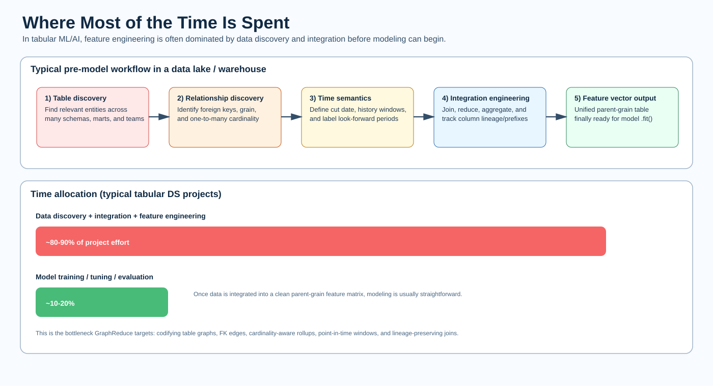
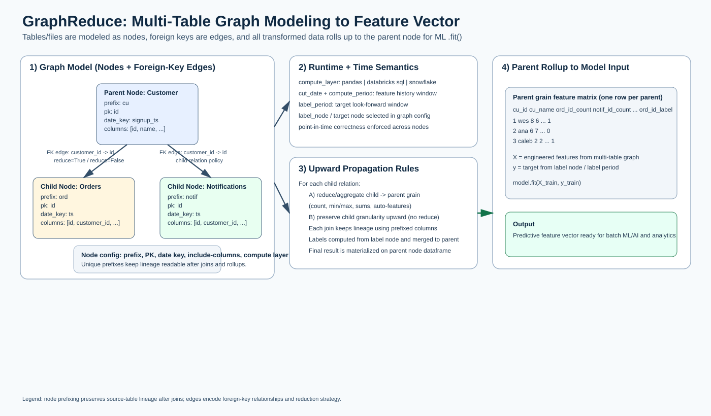

# GraphReduce


## Description
GraphReduce is a relational feature engineering system for serious tabular
ML and AI workloads. It encodes relational algebra directly into a graph of
tables, keys, and time boundaries so you can build model-ready datasets from
many sources without hand-rolling fragile join logic for every project.

The core thesis is direct: heterogeneous tabular data does not yet have a
universal semantic representation like text or vision, so the strongest
practical path today is a hybrid stack:
relational algebra + robust feature synthesis + strong downstream models
(GBDT/CatBoost/XGBoost and tabular foundation models). GraphReduce is built
to make that stack production-real, not notebook-fragile.

Compute backends supported: `pandas`, `dask`, `duckdb`, `spark`, `daft`, AWS Athena, Redshift, Snowflake, postgresql, MySQL
Compute backends coming soon: `ray`

## Why GraphReduce
GraphReduce is built for the hardest part of predictive AI in enterprises:
turning many relational tables into leakage-safe, parent-grain training data
that actually survives production constraints. It provides production-grade
abstractions for multi-table feature engineering at scale:

* point-in-time correctness to avoid leakage and keep training data temporally valid
* cardinality-aware reductions and joins when traversing one-to-many table relationships
* deterministic column prefixing, where each table/node defines a unique prefix so integrated columns retain clear table lineage

This directly addresses the core bottleneck in tabular AI today: relational
integration, temporal correctness, and cardinality-safe rollups. Instead of
betting everything on data-hungry end-to-end relational neural architectures,
GraphReduce gives you the strongest practical base layer that interoperates
with both classical ML and emerging tabular foundation models.

## Where most of the time is spent


## Graph Modeling and Rollup



### Installation
```python
# core install (lightweight default)
pip install graphreduce

# optional backend extras
pip install "graphreduce[duckdb]"
pip install "graphreduce[spark]"
pip install "graphreduce[daft]"
pip install "graphreduce[ml]"
pip install "graphreduce[all]"

# from github (core)
pip install 'graphreduce@git+https://github.com/wesmadrigal/graphreduce.git'

# install from source (editable)
git clone https://github.com/wesmadrigal/graphreduce && cd graphreduce && pip install -e .
```


## Motivation
Machine learning requires [vectors of data](https://arxiv.org/pdf/1212.4569.pdf), but our tabular datasets
are disconnected.  They can be represented as a graph, where tables
are nodes and join keys are edges.  In many model building scenarios
there isn't a nice ML-ready vector waiting for us, so we must curate
the data by joining many tables together to flatten them into a vector.
This is the problem `graphreduce` sets out to solve.  

## Prior work
* [Deep Feature Synthesis](https://www.maxkanter.com/papers/DSAA_DSM_2015.pdf
)
* [One Button Machine (IBM)](https://arxiv.org/abs/1706.00327)
* [autofeat (BASF)](http://arxiv.org/pdf/1901.07329)
* [featuretools (inspired by Deep Feature Synthesis)](https://github.com/alteryx/featuretools)

## Shortcomings of prior work
* point in time correctness is not always handled well
* Deep Feature Synthesis and `featuretools` are limited to `pandas` and a couple of SQL databases
* One Button Machine from IBM uses `spark` but their implementation outside of the paper could not be found
* none of the prior implementations allow for custom computational graphs or additional third party libraries

## We extend prior works and add the following functionality:
* point in time correctness on arbitrarily large computational graphs
* extensible computational layers, with support currently spanning: `pandas`, `dask`, `spark`, AWS Athena, AWS Redshift, Snowflake, postgresql, mysql, `daft`
* customizable node implementations for a mix of dynamic and custom feature engineering with the ability to use third party libraries for portions (e.g., [cleanlab](https://github.com/cleanlab/cleanlab) for cleaning)


## To get this example schema ready for an ML model we need to do the following:
* define the node-level interface and operations for filtering, annotating, normalizing, and reducing
* select the [granularity](https://en.wikipedia.org/wiki/Granularity#Data_granularity)) to which we'll reduce our data: in this example `customer` 
* specify how much historical data will be included and what holdout period will be used (e.g., 365 days of historical data and 1 month of holdout data for labels)
* filter all data entities to include specified amount of history to prevent [data leakage](https://en.wikipedia.org/wiki/Leakage_(machine_learning))
* depth first, bottom up aggregation operations group by / aggregation operations to reduce data


1. End to end example:
```python
import datetime
import pandas as pd
from graphreduce.node import GraphReduceNode, DynamicNode
from graphreduce.enum import ComputeLayerEnum, PeriodUnit
from graphreduce.graph_reduce import GraphReduce

# source from a csv file with the relationships
# using the file at: https://github.com/wesmadrigal/GraphReduce/blob/master/examples/cust_graph_labels.csv
reldf = pd.read_csv('cust_graph_labels.csv')

# using the data from: https://github.com/wesmadrigal/GraphReduce/tree/master/tests/data/cust_data
files = {
    'cust.csv' : {'prefix':'cu'},
    'orders.csv':{'prefix':'ord'},
    'order_products.csv': {'prefix':'op'},
    'notifications.csv':{'prefix':'notif'},
    'notification_interactions.csv':{'prefix':'ni'},
    'notification_interaction_types.csv':{'prefix':'nit'}

}
# create graph reduce nodes
gr_nodes = {
    f.split('/')[-1]: DynamicNode(
        fpath=f,
        fmt='csv',
        pk='id',
        prefix=files[f]['prefix'],
        date_key=None,
        compute_layer=GraphReduceComputeLayerEnum.pandas,
        compute_period_val=730,
        compute_period_unit=PeriodUnit.day,
    )
    for f in files.keys()
}
gr = GraphReduce(
    name='cust_dynamic_graph',
    parent_node=gr_nodes['cust.csv'],
    fmt='csv',
    cut_date=datetime.datetime(2023,9,1),
    compute_layer=GraphReduceComputeLayerEnum.pandas,
    auto_features=True,
    auto_feature_hops_front=1,
    auto_feature_hops_back=2,
    label_node=gr_nodes['orders.csv'],
    label_operation='count',
    label_field='id',
    label_period_val=60,
    label_period_unit=PeriodUnit.day
)
# Add graph edges
for ix, row in reldf.iterrows():
    gr.add_entity_edge(
        parent_node=gr_nodes[row['to_name']],
        relation_node=gr_nodes[row['from_name']],
        parent_key=row['to_key'],
        relation_key=row['from_key'],
        reduce=True
    )


gr.do_transformations()
2024-04-23 13:49:41 [info     ] hydrating graph attributes
2024-04-23 13:49:41 [info     ] hydrating attributes for DynamicNode
2024-04-23 13:49:41 [info     ] hydrating attributes for DynamicNode
2024-04-23 13:49:41 [info     ] hydrating attributes for DynamicNode
2024-04-23 13:49:41 [info     ] hydrating attributes for DynamicNode
2024-04-23 13:49:41 [info     ] hydrating attributes for DynamicNode
2024-04-23 13:49:41 [info     ] hydrating attributes for DynamicNode
2024-04-23 13:49:41 [info     ] hydrating graph data
2024-04-23 13:49:41 [info     ] checking for prefix uniqueness
2024-04-23 13:49:41 [info     ] running filters, normalize, and annotations for <GraphReduceNode: fpath=notification_interaction_types.csv fmt=csv>
2024-04-23 13:49:41 [info     ] running filters, normalize, and annotations for <GraphReduceNode: fpath=notification_interactions.csv fmt=csv>
2024-04-23 13:49:41 [info     ] running filters, normalize, and annotations for <GraphReduceNode: fpath=notifications.csv fmt=csv>
2024-04-23 13:49:41 [info     ] running filters, normalize, and annotations for <GraphReduceNode: fpath=orders.csv fmt=csv>
2024-04-23 13:49:41 [info     ] running filters, normalize, and annotations for <GraphReduceNode: fpath=order_products.csv fmt=csv>
2024-04-23 13:49:41 [info     ] running filters, normalize, and annotations for <GraphReduceNode: fpath=cust.csv fmt=csv>
2024-04-23 13:49:41 [info     ] depth-first traversal through the graph from source: <GraphReduceNode: fpath=cust.csv fmt=csv>
2024-04-23 13:49:41 [info     ] reducing relation <GraphReduceNode: fpath=notification_interactions.csv fmt=csv>
2024-04-23 13:49:41 [info     ] performing auto_features on node <GraphReduceNode: fpath=notification_interactions.csv fmt=csv>
2024-04-23 13:49:41 [info     ] joining <GraphReduceNode: fpath=notification_interactions.csv fmt=csv> to <GraphReduceNode: fpath=notifications.csv fmt=csv>
2024-04-23 13:49:41 [info     ] reducing relation <GraphReduceNode: fpath=notifications.csv fmt=csv>
2024-04-23 13:49:41 [info     ] performing auto_features on node <GraphReduceNode: fpath=notifications.csv fmt=csv>
2024-04-23 13:49:41 [info     ] joining <GraphReduceNode: fpath=notifications.csv fmt=csv> to <GraphReduceNode: fpath=cust.csv fmt=csv>
2024-04-23 13:49:41 [info     ] reducing relation <GraphReduceNode: fpath=order_products.csv fmt=csv>
2024-04-23 13:49:41 [info     ] performing auto_features on node <GraphReduceNode: fpath=order_products.csv fmt=csv>
2024-04-23 13:49:41 [info     ] joining <GraphReduceNode: fpath=order_products.csv fmt=csv> to <GraphReduceNode: fpath=orders.csv fmt=csv>
2024-04-23 13:49:41 [info     ] reducing relation <GraphReduceNode: fpath=orders.csv fmt=csv>
2024-04-23 13:49:41 [info     ] performing auto_features on node <GraphReduceNode: fpath=orders.csv fmt=csv>
2024-04-23 13:49:41 [info     ] joining <GraphReduceNode: fpath=orders.csv fmt=csv> to <GraphReduceNode: fpath=cust.csv fmt=csv>
2024-04-23 13:49:41 [info     ] Had label node <GraphReduceNode: fpath=orders.csv fmt=csv>
2024-04-23 13:49:41 [info     ] computed labels for <GraphReduceNode: fpath=orders.csv fmt=csv>

gr.parent_node.df
cu_id	cu_name	notif_customer_id	notif_id_count	notif_customer_id_count	notif_ts_first	notif_ts_min	notif_ts_max	ni_notification_id_min	ni_notification_id_max	ni_notification_id_sum	ni_id_count_min	ni_id_count_max	ni_id_count_sum	ni_notification_id_count_min	ni_notification_id_count_max	ni_notification_id_count_sum	ni_interaction_type_id_count_min	ni_interaction_type_id_count_max	ni_interaction_type_id_count_sum	ni_ts_first_first	ni_ts_first_min	ni_ts_first_max	ni_ts_min_first	ni_ts_min_min	ni_ts_min_max	ni_ts_max_first	ni_ts_max_min	ni_ts_max_max	ord_customer_id	ord_id_count	ord_customer_id_count	ord_ts_first	ord_ts_min	ord_ts_max	op_order_id_min	op_order_id_max	op_order_id_sum	op_id_count_min	op_id_count_max	op_id_count_sum	op_order_id_count_min	op_order_id_count_max	op_order_id_count_sum	op_product_id_count_min	op_product_id_count_max	op_product_id_count_sum	ord_customer_id_dupe	ord_id_label
0	1	wes	1	6	6	2022-08-05	2022-08-05	2023-06-23	101.0	106.0	621.0	1.0	3.0	14.0	1.0	3.0	14.0	1.0	3.0	14.0	2022-08-06	2022-08-06	2023-05-15	2022-08-06	2022-08-06	2023-05-15	2022-08-08	2022-08-08	2023-05-15	1.0	2.0	2.0	2023-05-12	2023-05-12	2023-06-01	1.0	2.0	3.0	4.0	4.0	8.0	4.0	4.0	8.0	4.0	4.0	8.0	1.0	1.0
1	2	john	2	7	7	2022-09-05	2022-09-05	2023-05-22	107.0	110.0	434.0	1.0	1.0	4.0	1.0	1.0	4.0	1.0	1.0	4.0	2023-06-01	2023-06-01	2023-06-04	2023-06-01	2023-06-01	2023-06-04	2023-06-01	2023-06-01	2023-06-04	2.0	1.0	1.0	2023-01-01	2023-01-01	2023-01-01	3.0	3.0	3.0	4.0	4.0	4.0	4.0	4.0	4.0	4.0	4.0	4.0	NaN	NaN
2	3	ryan	3	2	2	2023-06-12	2023-06-12	2023-09-01	NaN	NaN	0.0	NaN	NaN	0.0	NaN	NaN	0.0	NaN	NaN	0.0	NaT	NaT	NaT	NaT	NaT	NaT	NaT	NaT	NaT	3.0	1.0	1.0	2023-06-01	2023-06-01	2023-06-01	5.0	5.0	5.0	1.0	1.0	1.0	1.0	1.0	1.0	1.0	1.0	1.0	NaN	NaN
3	4	tianji	4	2	2	2024-02-01	2024-02-01	2024-02-15	NaN	NaN	0.0	NaN	NaN	0.0	NaN	NaN	0.0	NaN	NaN	0.0
```

2. Plot the graph reduce compute graph.
```python
gr.plot_graph('my_graph_reduce.html')
```


3. Use materialized dataframe for ML / analytics
```python

from sklearn.linear_model import LinearRegression
from sklearn.model_selection import train_test_split
train, test = train_test_split(gr.parent_node.df)

X = [x for x, y in dict(gr.parent_node.df.dtypes).items() if str(y).startswith('int') or str(y).startswith('float')]
# whether or not the user had an order
Y = 'ord_id_label'
mdl = LinearRegression()
mdl.fit(train[X], train[Y])
```

## Core data integration traversal algorithm
```text
do_transformations and do_transformations_sql

Let G = (V, E) be a directed graph.
Each edge e = (p, r) has metadata:
  kappa_e = (k_p, k_r, rho_e, alpha_e)
where:
  k_p = parent key
  k_r = relation key
  rho_e in {0,1} = reduce flag
  alpha_e in {0,1} = reduce_after_join flag

For each node v in V, with table D_v:
  A_v(.) = do_annotate
  F_v(.) = do_filters
  N_v(.) = do_normalize

Initialization:
  for all v in V:
    D_v <- N_v(F_v(A_v(D_v)))
after:
  hydrate_graph_attrs, hydrate_graph_data, prefix_uniqueness

If auto_features front traversal is enabled:
  for (t, s, level) in traverse_up(parent), level <= h_f:
    D_t <- LEFT_JOIN(D_t, D_s) on t[k_t] = s[k_s]
    # join_any

DFS order used by do_transformations:
  E_dfs = reverse(dfs_edges(G, source=parent, depth_limit=h_b))

For each e = (p, r) in E_dfs:
  1) Relation feature table:
       if rho_e == 1:
         J_e = R_r(k_r)            # do_reduce
       else:
         J_e = empty

  2) Optional auto features on relation node:
       if auto_features and rho_e == 1:
         Phi_r(k_r) = auto_features(r, k_r)
         J_e <- JOIN_ON_KEY(J_e, Phi_r, k_r)
         # if J_e is empty, J_e <- Phi_r

  3) Join relation into parent:
       D_p <- LEFT_JOIN(D_p, J_e) on p[k_p] = r[k_r]
       # join(parent_node, relation_node, relation_df=J_e)
       # if J_e is empty, join uses D_r

  4) Optional labels:
       if r is label node or r has label_field:
         L_r(k_r) =
           default_label(...)   if r is DynamicNode
           do_labels(k_r)       if r is GraphReduceNode
         D_p <- LEFT_JOIN(D_p, L_r) on p[k_p] = r[k_r]

  5) Post-join operations on parent:
       D_p <- do_post_join_annotate(D_p)
       D_p <- do_post_join_filters(D_p)    # if defined
       if alpha_e == 1:
         D_p <- do_post_join_reduce(D_p, k_r)
```


# SQL Auto-Feature Families

`do_transformations_sql()` can compile a relational graph into SQL feature
frames without requiring a hand-written aggregation for every child table.
The SQL planner works at each reduced relation before that relation is joined
to its parent. In other words, a child table is first filtered to the current
point in time, annotated, and grouped by the edge key; the resulting columns
are then propagated up the graph. A feature family therefore describes a
repeatable class of relational operations at a particular node and hop, not a
model-specific feature list.

The families are selected per node with `feature_families`. The default is
`("base",)`, so the additional families are deliberately opt-in:

```python
events = DuckdbNode(
    fpath="events",
    fmt="sql",
    pk="event_id",
    prefix="evt",
    date_key="event_time",
    compute_layer=ComputeLayerEnum.duckdb,
    feature_families=("base", "temporal", "sequence", "conditional"),
    ts_periods=(7, 30, 90, 365),
    feature_family_max_columns=4,
    categorical_top_k=5,
)
```

`GraphReduce` still needs `auto_features=True` and the graph must be executed
through `do_transformations_sql()` for these SQL operations to be compiled.
The families are additive: enabling `temporal` does not implicitly enable
`sequence`, and enabling `context` does not guess a peer relationship. The
same selected families are applied whenever that node is reduced during the
graph traversal.

### A note about time-series features

`ts_periods` is a list of lookback lengths in days. For a node with a
`date_key`, every window is evaluated relative to the current row's
point-in-time reference when one is available, or relative to the graph's
`cut_date` otherwise. Rows after that reference are excluded, and the
compute-period filter bounds how far back the node can contribute data. This
is the mechanism that keeps historical features from using future rows.

The default periods are `1, 3, 4, 7, 14, 30, 60, 90, 180, 365, 730`. Setting
`ts_periods=()` disables the legacy rolling time features and the
family-specific window features. A period larger than the available
`compute_period_val` cannot produce additional historical signal because the
underlying rows have already been excluded. Long-horizon tasks should raise
the compute period as well as the period list; changing only the list does
not recover data outside the compute horizon.

There are two temporal layers in the SQL planner:

1. `base` includes the legacy recency and event-volume features for every
   time-series relation: seconds since the most recent event, an event count
   for each configured period, and ratios between adjacent periods.
2. `temporal`, `conditional`, `sequence`, and `episode` add specialized
   windows described below. These are not replacements for the base layer;
   they add different views of the same point-in-time history.

### `base`: schema-aware rollups

`base` is the conservative propagation layer and is enabled by default. It
infers physical and semantic types from a sample of the node, then emits
aggregation operations that are valid for those types. It is designed to
turn an arbitrary relational child into a useful parent-grain summary without
requiring domain annotations.

For the ordinary columns in a child relation, `base` does the following:

* Identifier-like columns contribute counts. GraphReduce intentionally emits
  only one general row/count aggregate rather than a separate count for every
  identifier column, which prevents redundant count features after joins.
* Numeric columns use the configured `type_func_map`, commonly producing
  operations such as `sum`, `avg`, `min`, and `max`. The SQL implementation
  skips operations that are unsafe for the inferred physical type.
* Boolean columns become numeric sums, equivalent to the number of true rows.
  This makes flags such as `verified`, `clicked`, or `completed` usable by
  tree models after a one-to-many reduction.
* Date and timestamp columns can contribute first/min/max-style summaries
  according to the type-function map. Time-series nodes additionally get
  recency relative to the current reference date.
* Categorical columns contribute a distinct-value count and, for selected
  values, count/share/presence summaries. Low-cardinality columns use every
  observed value; high-cardinality columns use the most frequent
  `categorical_top_k` values plus an `other` bucket.
* Text-looking columns can contribute average, maximum, and total character
  length; average and maximum word count; and count/share/presence indicators
  for empty values, URLs, embedded numbers, question marks, and exclamation
  marks. These are enabled by `auto_text_features=True`, which is independent
  of the named feature families.

For a time-series child, `base` also emits:

* `seconds_since_last`, the time between the point-in-time reference and the
  latest available child event;
* `num_events_{period}d`, the number of child rows in each lookback window;
* `d{short}v{long}_change`, the safe ratio of a shorter-window event count to
  the next longer-window count.

These base features answer broad questions such as how much activity this
parent has had and how recently anything happened. They do not, by
themselves, distinguish activity types, measure peer-relative values, or
describe the shape of a sequence. The additional families address those
gaps.

### `semantic`: caller-defined meaning

`semantic` is the bridge between schema-agnostic SQL generation and known
domain meaning. The caller supplies `annotation_expressions`, a mapping from
feature names to SQL predicates or value expressions. GraphReduce compiles
those expressions into columns before reduction:

```python
annotation_expressions={
    "is_verified": "{status} = 'verified'",
    "is_high_value": "{amount} >= 100",
    "normalized_amount": ("value", "{amount} * {quantity}"),
}
```

Predicate annotations become numeric `0/1` indicators. Value annotations
preserve the expression result, so the normal numeric aggregation path can
sum, average, minimize, or maximize it. Placeholders such as `{amount}` are
resolved against the node's columns, including prefixed columns when
appropriate.

The semantic family does not invent business concepts from a column name.
It makes explicitly supplied concepts composable with the other families:
the resulting indicator can be counted by `base`, and can receive
window-specific count/share/presence features through `conditional`.
Likewise, an annotated numeric value can be selected by `temporal` for
windowed sum/average/min/max features.

There are two ways to use this family:

* With `annotation_expressions`, it compiles the requested expressions. This
  is the normal deterministic mode.
* With `auto_annotate_features=True`, GraphReduce may also infer bounded
  categorical indicators, text indicators, and numeric values gated by top
  categorical values. The limits are controlled by
  `auto_annotate_max_categorical_columns`,
  `auto_annotate_max_gated_numeric_cols`, and
  `auto_annotate_gated_numeric_top_k`.

`semantic` is only activated by `do_transformations_sql()` when there are
annotation expressions, unless generic auto-annotation is enabled. Therefore
adding the string `"semantic"` alone does not create arbitrary semantic
features.

### `conditional`: what kind of activity?

`conditional` preserves the composition of activity that a plain event count
loses. It selects two kinds of conditions from the child sample:

* predicate annotation columns created by the semantic/auto-annotation step;
* categorical values, prioritizing frequent values and respecting
  `categorical_top_k`.

For each selected condition and each `ts_periods` window, it emits:

* `*_count_{period}d`: number of rows satisfying the condition;
* `*_share_{period}d`: condition count divided by all rows in the window;
* `*_any_{period}d`: whether the condition appeared at least once.

For adjacent periods it also emits a count-change ratio. For example, a
`status = 'verified'` condition can become recent verified count, recent
verified share, verified presence, and short-window versus long-window
change features. This is useful when the label depends on status mix, action
type, outcome, or a sparse but important event rather than total volume.

The family gives semantic predicates and categorical values the same
point-in-time treatment as numeric windows. It skips identifiers, dates,
collections, and text-like free-form strings. Semantic predicate conditions
are prioritized before generic categorical conditions. The number of selected
conditions is capped by `feature_family_max_columns`.

Approximate output count for `S` selected conditions and `P` periods is
`S * (3P + (P - 1))`, before any base features and before downstream graph
hops. This is one of the quickest families to make large when many status or
category values are selected.

### `temporal`: how numeric values change over time

`temporal` applies the lookback windows to numeric measurements instead of
only counting rows. It selects annotated numeric columns first, then generic
numeric columns, up to `feature_family_max_columns`. Identifier-like values,
the reduce key, and the date column are excluded.

For every selected numeric column and every period, it emits four windowed
aggregates:

* `sum`: total amount in the window;
* `avg`: average amount among rows in the window;
* `min`: smallest observed value in the window;
* `max`: largest observed value in the window.

The expressions use conditional SQL aggregates, so rows outside the window
produce null inputs rather than being accidentally mixed into the statistic.
This family is useful for spend, price, quantity, score, duration, or other
measurements where two entities can have identical event counts but very
different magnitudes.

For `N` selected numeric columns and `P` periods, the family contributes
approximately `4 * N * P` columns. It is usually a good first additional
family for numeric-heavy relations, but `feature_family_max_columns` should
be kept small on wide or deeply connected graphs.

### `sequence`: cadence, concentration, and active span

`sequence` describes the timing shape of activity. It is intentionally
aggregate-safe: it does not expose an ordered event list to the model, but
it retains more trajectory information than lifetime count plus latest-event
recency.

For every period it emits:

* `activity_rate_{period}d`: events per day in the window;
* `activity_share_{period}d`: events in the window divided by lifetime events.

For each adjacent pair of periods it emits:

* `activity_burst_{short}v{long}`: short-window activity divided by
  long-window activity.

It also emits lifetime sequence summaries when the SQL dialect supports the
required date arithmetic:

* `active_span_seconds`: the difference between the first and last event;
* `activities_per_active_day`: lifetime activity divided by the active span
  in days, with a one-day floor to avoid division by zero.

These features separate steady activity from recent bursts, long-dormant
entities, and entities with many events compressed into a short interval.
They are especially relevant to churn, repeat behavior, engagement, and
time-to-outcome problems. With `P` periods, the family emits approximately
`2P + (P - 1) + 2` columns.

### `episode`: rows versus distinct episodes

`episode` makes the unit of activity explicit. It always emits a total row
count, `num_episodes`, and emits `num_unique_episodes` when the node has a
primary key visible in the inference sample. On a time-series relation it
also emits windowed row counts and, when possible, windowed distinct-primary-
key counts for every configured period.

The distinction matters after joins. A many-to-many relationship can create
several rows for one logical episode, so row count can measure join volume
while distinct primary-key count measures the number of underlying events or
records. Both can be predictive, and their ratio can reveal duplication or
many-to-many structure without writing custom feature code.

With a primary key, the family contributes two lifetime columns and two
columns per time window. Without a usable primary key it contributes one
lifetime column and one column per window. It is generally cheaper than
`temporal` or `conditional` because it does not multiply over source columns
or category values.

### `context`: peer-relative values before reduction

`context` computes comparisons within a caller-defined peer group before
child rows are reduced to the parent. The caller supplies `context_keys`,
because GraphReduce cannot safely infer whether a column such as `category`,
`race_id`, `event_id`, or `merchant_id` represents the intended comparison
group in an arbitrary schema.

For each resolved context key, it emits:

* `context_size`: the number of rows sharing that peer-group value;
* for selected numeric columns, `value - peer_group_average(value)`.

The context delta is a signed peer-relative signal. For example, an item
price can be represented relative to the average price in its category, a
driver result relative to the other drivers in a race, or an attendance
measurement relative to the other attendees at an event. Those row-level
values are then passed through the normal reduction and propagated to the
parent, so the parent can receive summaries of its members' peer-relative
position.

Context keys are resolved against exact, case-insensitive, prefixed, or
unique suffix matches. Identifier-like, date-like, primary-key, and already
auto-annotated columns are excluded from the numeric delta candidates. The
number of numeric columns per context key is capped by
`feature_family_max_columns`.

`context` requires both `feature_families` to contain `"context"` and a
non-empty `context_keys` configuration. It is therefore explicit by design:
an incorrect peer group can create plausible but misleading features, so the
library does not guess one.

### Text is a base capability, not a separate family

Text handling is part of the `base` schema-aware path and is controlled by
`auto_text_features`. It is not a separate entry in `feature_families`.
When enabled, GraphReduce detects text-like strings from their inferred type,
length, spacing, and column-name hints, then generates the text summaries
listed under `base`. It does not tokenize, embed, or run a language model;
the generated signals are inexpensive SQL measurements that can be useful
for descriptions, comments, URLs, and message-like fields. Set
`auto_text_features=False` when those expressions are too expensive or when
free-form text should not be inspected.

### Feature-budget and selection rules

The families are composable, but enabling every family on every node is not
the default recommendation. The main controls are:

* `feature_families`: selects the named families. If omitted, only `base` is
  enabled. Unknown names fail fast rather than silently changing the feature
  program.
* `ts_periods`: controls the number and duration of temporal windows used by
  the base rolling features and the time-aware families.
* `feature_family_max_columns`: bounds the number of numeric source columns
  selected by `temporal` and `context`, and the number of conditions selected
  by `conditional`. It is not a blanket cap on all base aggregates.
* `categorical_cardinality_threshold`: controls when base categorical
  summaries use all values versus a top-value subset.
* `categorical_top_k`: controls the top-value subset for high-cardinality
  base categories and generic conditional conditions.
* `auto_text_features`: enables or disables base text summaries.
* `annotation_expressions`: supplies explicit semantic predicates or values.
* `context_keys`: supplies the peer groups used by `context`.

A useful staged configuration is:

1. Start with `("base",)` to establish a cheap, broad relational baseline.
2. Add `"temporal"` for numeric measurements whose magnitude or trend may
   matter.
3. Add `"sequence"` for cadence, recency concentration, burstiness, or
   repeated behavior.
4. Add `"conditional"` when categories, statuses, outcomes, or domain
   predicates may matter; keep `categorical_top_k` and
   `feature_family_max_columns` bounded.
5. Add `"episode"` when row multiplicity and distinct event identity have
   different meanings.
6. Add `"semantic"` only with domain annotations worth testing, and add
   `"context"` only when a peer group has a clear business or relational
   definition.

The approximate family formulas describe only newly generated columns at a
single relation. A graph with several child tables, multiple reduction hops,
many periods, or repeated wide joins can multiply the work and the final
frame size. For large problems, activate the families on the nodes where
their signal is plausible instead of applying the same maximal configuration
to every table.

# API definition

## GraphReduce instantiation and parameters
`graphreduce.graph_reduce.GraphReduce`
* `cut_date` controls the date around which we orient the data in the graph
* `compute_period_val` controls the amount of time back in history we consider during compute over the graph
* `compute_period_unit` tells us what unit of time we're using
* `parent_node` specifies the parent-most node in the graph and, typically, the granularity to which to reduce the data
```python
from graphreduce.graph_reduce import GraphReduce
from graphreduce.enums import PeriodUnit
gr = GraphReduce(
    cut_date=datetime.datetime(2023, 2, 1), 
    compute_period_val=365, 
    compute_period_unit=PeriodUnit.day,
    parent_node=customer
)
```

## GraphReduce commonly used functions
* `do_transformations` perform all data transformations
* `plot_graph` plot the graph
* `add_entity_edge` add an edge
* `add_node` add a node

## Node definition and parameters
`graphreduce.node.GraphReduceNode`
* `do_annotate` annotation definitions (e.g., split a string column into a new column)
* `do_filters` filter the data on column(s)
* `do_normalize` clip anomalies like exceedingly large values and do normalization
* `post_join_annotate` annotations on current node after relations are merged in and we have access to their columns, too
* `do_reduce` the most import node function, reduction operations: group bys, sum, min, max, etc.
* `do_labels` label definitions if any
```python
# alternatively can use a dynamic node
from graphreduce.node import DynamicNode

dyna = DynamicNode(
    fpath='s3://some.bucket/path.csv',
    compute_layer=ComputeLayerEnum.dask,
    fmt='csv',
    prefix='myprefix',
    date_key='ts',
    pk='id'
)
```

## Node commonly used functions
* `colabbr` abbreviate a column
* `prep_for_features` filter the node's data by the cut date and the compute period for point in time correctness, also referred to as "time travel" in blogs
* `prep_for_labels` filter the node's data by the cut date and the label period to prepare for labeling

## Stuff brewing in the project
GraphReduce's reusable SQL feature families are becoming an intermediate
representation for joint relational AutoML: the feature program and the
downstream model can be optimized together instead of treating feature
engineering as a fixed preprocessing step.

1. **Feature program generator**: generate candidate relational operations
   from the `base`, `semantic`, `conditional`, `temporal`, `sequence`,
   `episode`, and `context` families, including caller-configured domain
   predicates, explicit peer-relative signals, lookback windows, graph hops,
   and aggregation functions. The additional families are opt-in so large
   graphs can keep a bounded feature budget.
2. **Meta-policy/controller**: learn which operations and feature budgets are
   promising from the task schema, graph structure, cardinalities, sparsity,
   and label type. The controller can rank candidates or propose a complete
   feature program.
3. **Actual estimator**: materialize the selected point-in-time features and
   fit CatBoost, XGBoost, or another downstream model. Its validation metric
   supplies the optimization signal for both feature choices and model
   hyperparameters.

Across many datasets and tasks, these optimization traces become training
data for a relational tabular foundation model: schema and graph context,
candidate feature programs, model configurations, validation behavior,
predictions, residuals, and resource costs. The resulting model can transfer
feature recipes and hyperparameter priors to unseen relational problems,
eventually supporting zero-shot or few-shot task adaptation. The official
test split remains reserved for final evaluation so the controller learns
generalizable policies rather than benchmark-specific ones.


## License
Copyright 2026 Wes Madrigal

Permission is hereby granted, free of charge, to any person obtaining a copy of this software and associated documentation files (the “Software”), to deal in the Software without restriction, including without limitation the rights to use, copy, modify, merge, publish, distribute, sublicense, and/or sell copies of the Software, and to permit persons to whom the Software is furnished to do so, subject to the following conditions:

The above copyright notice and this permission notice shall be included in all copies or substantial portions of the Software.

THE SOFTWARE IS PROVIDED “AS IS”, WITHOUT WARRANTY OF ANY KIND, EXPRESS OR IMPLIED, INCLUDING BUT NOT LIMITED TO THE WARRANTIES OF MERCHANTABILITY, FITNESS FOR A PARTICULAR PURPOSE AND NONINFRINGEMENT. IN NO EVENT SHALL THE AUTHORS OR COPYRIGHT HOLDERS BE LIABLE FOR ANY CLAIM, DAMAGES OR OTHER LIABILITY, WHETHER IN AN ACTION OF CONTRACT, TORT OR OTHERWISE, ARISING FROM, OUT OF OR IN CONNECTION WITH THE SOFTWARE OR THE USE OR OTHER DEALINGS IN THE SOFTWARE.

## Roadmap
* Develop a meta-model that jointly optimizes the relational operations
  GraphReduce generates from its feature families and the downstream model's
  hyperparameters. The meta-model will select a high-performing feature
  program and model configuration within validation-quality, search-budget,
  and resource constraints. By
  learning transferable priors from optimization traces across many datasets
  and tasks, it can serve as the basis for a relational tabular foundation
  model.
