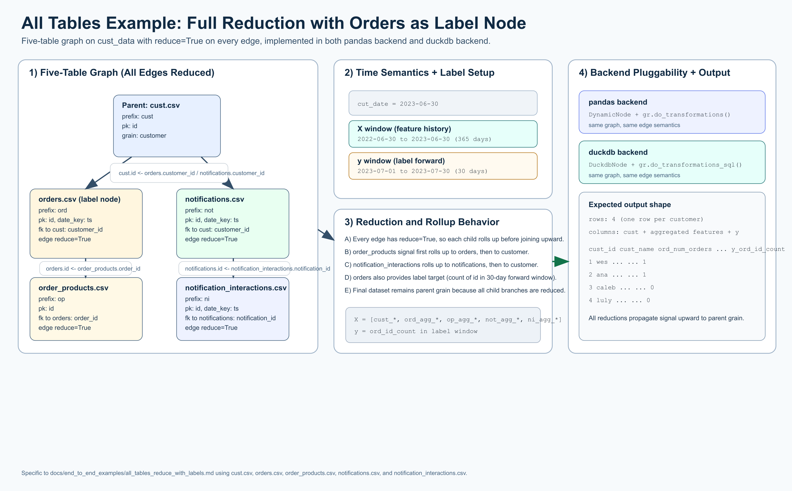

# All Tables, Full Reduction, With Labels

[](all_tables_reduce_with_labels_overview.png)

Open full-size: [PNG](all_tables_reduce_with_labels_overview.png) | [SVG](all_tables_reduce_with_labels_overview.svg)

This example highlights GraphReduce backend pluggability with the **same graph
semantics** implemented in both a `pandas backend` and a `duckdb backend`.

In this scenario:

* we use 5 tables from `tests/data/cust_data/*`
* all edges are `reduce=True`
* `orders.csv` is the label/target node
* features use a 365-day lookback from `cut_date`
* labels use a 30-day look-forward window

## Tables Used

* `cust.csv` (parent node)
* `orders.csv` (label node)
* `order_products.csv`
* `notifications.csv`
* `notification_interactions.csv`

## pandas backend

```python
import datetime
from pathlib import Path

from graphreduce.node import DynamicNode
from graphreduce.graph_reduce import GraphReduce
from graphreduce.enum import ComputeLayerEnum, PeriodUnit

data_path = Path("tests/data/cust_data")

cust_node = DynamicNode(
    fpath=str(data_path / "cust.csv"),
    fmt="csv",
    prefix="cust",
    date_key=None,
    pk="id",
)

orders_node = DynamicNode(
    fpath=str(data_path / "orders.csv"),
    fmt="csv",
    prefix="ord",
    date_key="ts",
    pk="id",
)

order_products_node = DynamicNode(
    fpath=str(data_path / "order_products.csv"),
    fmt="csv",
    prefix="op",
    date_key=None,
    pk="id",
)

notifications_node = DynamicNode(
    fpath=str(data_path / "notifications.csv"),
    fmt="csv",
    prefix="not",
    date_key="ts",
    pk="id",
)

notification_interactions_node = DynamicNode(
    fpath=str(data_path / "notification_interactions.csv"),
    fmt="csv",
    prefix="ni",
    date_key="ts",
    pk="id",
)

gr = GraphReduce(
    name="all_tables_reduce_with_labels_pandas",
    parent_node=cust_node,
    fmt="csv",
    compute_layer=ComputeLayerEnum.pandas,
    auto_features=True,
    auto_labels=True,
    cut_date=datetime.datetime(2023, 6, 30),
    compute_period_unit=PeriodUnit.day,
    compute_period_val=365,
    label_node=orders_node,
    label_field="id",
    label_operation="count",
    label_period_unit=PeriodUnit.day,
    label_period_val=30,
    auto_feature_hops_back=3,
    auto_feature_hops_front=1,
)

gr.add_node(cust_node)
gr.add_node(orders_node)
gr.add_node(order_products_node)
gr.add_node(notifications_node)
gr.add_node(notification_interactions_node)

gr.add_entity_edge(
    parent_node=cust_node,
    relation_node=orders_node,
    parent_key="id",
    relation_key="customer_id",
    relation_type="parent_child",
    reduce=True,
)

gr.add_entity_edge(
    parent_node=orders_node,
    relation_node=order_products_node,
    parent_key="id",
    relation_key="order_id",
    relation_type="parent_child",
    reduce=True,
)

gr.add_entity_edge(
    parent_node=cust_node,
    relation_node=notifications_node,
    parent_key="id",
    relation_key="customer_id",
    relation_type="parent_child",
    reduce=True,
)

gr.add_entity_edge(
    parent_node=notifications_node,
    relation_node=notification_interactions_node,
    parent_key="id",
    relation_key="notification_id",
    relation_type="parent_child",
    reduce=True,
)

gr.do_transformations()

print("rows:", len(gr.parent_node.df))
print("columns:", len(gr.parent_node.df.columns))
print(gr.parent_node.df.head())
```

## duckdb backend

```python
import datetime
from pathlib import Path

import duckdb

from graphreduce.node import DuckdbNode
from graphreduce.graph_reduce import GraphReduce
from graphreduce.enum import ComputeLayerEnum, PeriodUnit

data_path = Path("tests/data/cust_data")
con = duckdb.connect()

cust_node = DuckdbNode(
    fpath=f"'{data_path / 'cust.csv'}'",
    prefix="cust",
    pk="id",
    columns=["id", "name"],
    table_name="customer",
)

orders_node = DuckdbNode(
    fpath=f"'{data_path / 'orders.csv'}'",
    prefix="ord",
    pk="id",
    date_key="ts",
    columns=["id", "customer_id", "ts", "amount"],
    table_name="orders",
)

order_products_node = DuckdbNode(
    fpath=f"'{data_path / 'order_products.csv'}'",
    prefix="op",
    pk="id",
    columns=["id", "order_id", "product_id"],
    table_name="order_products",
)

notifications_node = DuckdbNode(
    fpath=f"'{data_path / 'notifications.csv'}'",
    prefix="not",
    pk="id",
    date_key="ts",
    columns=["id", "customer_id", "ts"],
    table_name="notifications",
)

notification_interactions_node = DuckdbNode(
    fpath=f"'{data_path / 'notification_interactions.csv'}'",
    prefix="ni",
    pk="id",
    date_key="ts",
    columns=["id", "notification_id", "interaction_type_id", "ts"],
    table_name="notification_interactions",
)

gr = GraphReduce(
    name="all_tables_reduce_with_labels_duckdb",
    parent_node=cust_node,
    compute_layer=ComputeLayerEnum.duckdb,
    sql_client=con,
    auto_features=True,
    auto_labels=True,
    cut_date=datetime.datetime(2023, 6, 30),
    compute_period_unit=PeriodUnit.day,
    compute_period_val=365,
    label_node=orders_node,
    label_field="id",
    label_operation="count",
    label_period_unit=PeriodUnit.day,
    label_period_val=30,
    auto_feature_hops_back=3,
    auto_feature_hops_front=1,
)

gr.add_node(cust_node)
gr.add_node(orders_node)
gr.add_node(order_products_node)
gr.add_node(notifications_node)
gr.add_node(notification_interactions_node)

gr.add_entity_edge(
    parent_node=cust_node,
    relation_node=orders_node,
    parent_key="id",
    relation_key="customer_id",
    reduce=True,
)

gr.add_entity_edge(
    parent_node=orders_node,
    relation_node=order_products_node,
    parent_key="id",
    relation_key="order_id",
    reduce=True,
)

gr.add_entity_edge(
    parent_node=cust_node,
    relation_node=notifications_node,
    parent_key="id",
    relation_key="customer_id",
    reduce=True,
)

gr.add_entity_edge(
    parent_node=notifications_node,
    relation_node=notification_interactions_node,
    parent_key="id",
    relation_key="notification_id",
    reduce=True,
)

gr.do_transformations_sql()
out_df = con.sql(f"select * from {gr.parent_node._cur_data_ref}").to_df()

print("rows:", len(out_df))
print("columns:", len(out_df.columns))
print(out_df.head())

con.close()
```

## What To Expect

* Both backends execute the same graph structure and reduction strategy.
* Because all edges are reduced, output returns to parent grain (one row per customer).
* The output includes engineered features and label/target columns from `orders.csv`.
* Time handling is point-in-time safe:
  * X uses `cut_date - 365 days` through `cut_date`
  * y uses `cut_date + 1 day` through `cut_date + 30 days`
