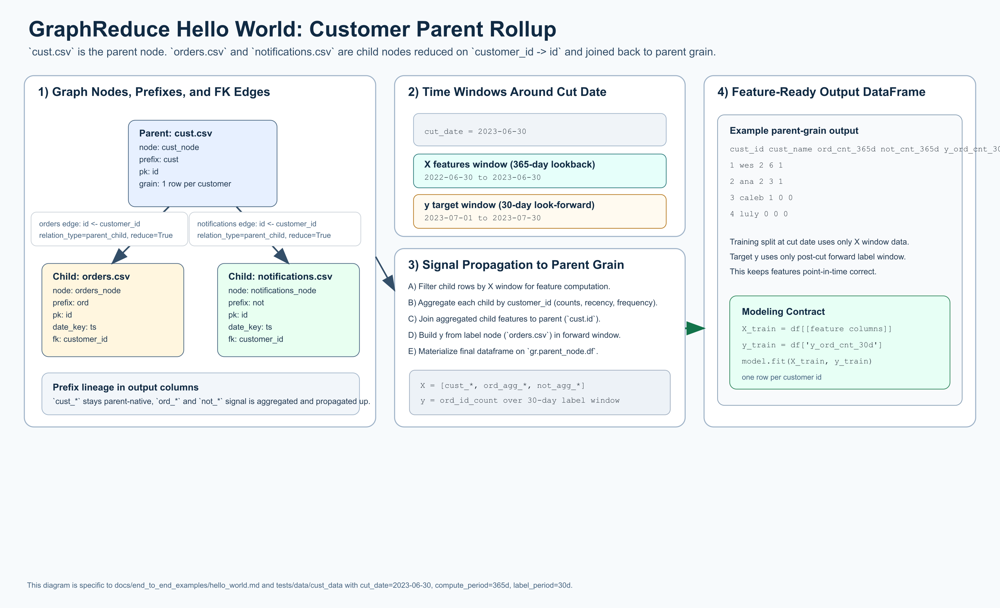

# Hello World

[](hello_world_overview.png)

Open full-size: [PNG](hello_world_overview.png) | [SVG](hello_world_overview.svg)

The diagram above shows the exact graph shape and time handling for this example:
`cust.csv` as parent, `orders.csv` and `notifications.csv` as children, 365-day
lookback features (X), and a 30-day forward label window (y).

This example is a minimal end-to-end GraphReduce workflow using the same sample
files used in `tests/test_graph_reduce.py`, specifically from
`tests/data/cust_data/*`.

It mirrors the `test_multi_node_customer` flow:

* parent table: `cust.csv`
* relation tables: `orders.csv`, `notifications.csv`
* automated feature generation enabled
* automated label generation enabled

## Prerequisites

Run from the repository root so `tests/data/cust_data` resolves correctly.

Install GraphReduce core (no backend extras needed for this example):

```bash
pip install graphreduce
```

## Complete Example

```python
import datetime
from pathlib import Path

from graphreduce.node import DynamicNode
from graphreduce.graph_reduce import GraphReduce
from graphreduce.enum import ComputeLayerEnum, PeriodUnit

data_path = Path("tests/data/cust_data")

cust_node = DynamicNode(
    fpath=str(data_path / "cust.csv"),
    fmt="csv",
    prefix="cust",
    date_key=None,
    pk="id",
)

orders_node = DynamicNode(
    fpath=str(data_path / "orders.csv"),
    fmt="csv",
    prefix="ord",
    date_key="ts",
    pk="id",
)

notifications_node = DynamicNode(
    fpath=str(data_path / "notifications.csv"),
    fmt="csv",
    prefix="not",
    date_key="ts",
    pk="id",
)

gr = GraphReduce(
    name="hello_world",
    parent_node=cust_node,
    fmt="csv",
    compute_layer=ComputeLayerEnum.pandas,
    auto_features=True,
    auto_labels=True,
    cut_date=datetime.datetime(2023, 6, 30),
    compute_period_unit=PeriodUnit.day,
    compute_period_val=365,
    label_node=orders_node,
    label_field="id",
    label_operation="count",
    label_period_unit=PeriodUnit.day,
    label_period_val=30,
    auto_feature_hops_back=3,
    auto_feature_hops_front=0,
)

gr.add_node(cust_node)
gr.add_node(orders_node)
gr.add_node(notifications_node)

gr.add_entity_edge(
    parent_node=cust_node,
    relation_node=orders_node,
    parent_key="id",
    relation_key="customer_id",
    relation_type="parent_child",
    reduce=True,
)

gr.add_entity_edge(
    parent_node=cust_node,
    relation_node=notifications_node,
    parent_key="id",
    relation_key="customer_id",
    relation_type="parent_child",
    reduce=True,
)

gr.do_transformations()

print("rows:", len(gr.parent_node.df))
print("columns:", len(gr.parent_node.df.columns))
print(gr.parent_node.df.head())
```

## What To Expect

* The final dataframe is materialized on `gr.parent_node.df`.
* With this sample dataset, you should see `4` rows (one per customer in `cust.csv`).
* Output columns include original parent columns plus generated feature/label columns.

## Run Interactive

This example can also run through the local interactive runner and stream logs
in the docs UI. It uses the pandas backend, so no optional backend extras are
required.

```bash
pip install graphreduce
pip install -r docs/api/requirements.txt
python docs/api/modal_stream_server.py
mkdocs serve
```

The interactive API runs `python examples/hello_world_local_runner.py` on the
server host and streams stdout to the browser terminal.

For a browser-based live log view, use
[Interactive Runner](hello_world_modal_interactive.md).

<a class="md-button md-button--primary" href="hello_world_modal_interactive.md">Open Interactive Runner</a>

## Sample Data Files Used

* `tests/data/cust_data/cust.csv`
* `tests/data/cust_data/orders.csv`
* `tests/data/cust_data/notifications.csv`
