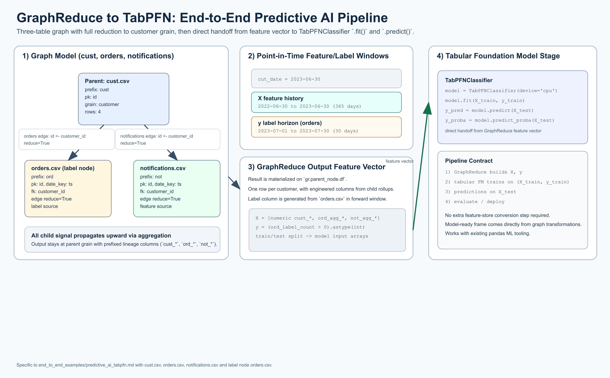
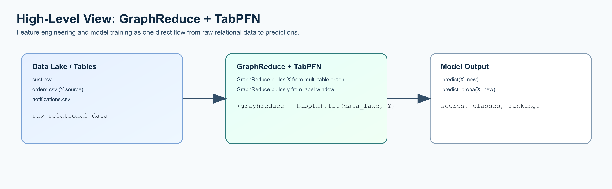

# End-to-End Predictive AI with TabPFN

[](predictive_ai_tabpfn_overview.png)

Open full-size: [PNG](predictive_ai_tabpfn_overview.png) | [SVG](predictive_ai_tabpfn_overview.svg)

[](predictive_ai_tabpfn_high_level.png)

Open full-size: [PNG](predictive_ai_tabpfn_high_level.png) | [SVG](predictive_ai_tabpfn_high_level.svg)

This example uses three tables:

* `cust.csv` (parent)
* `orders.csv` (label/target node)
* `notifications.csv`

All edges are reduced to customer grain, and the resulting GraphReduce feature
vector is sent directly into a tabular foundation model (`TabPFNClassifier`)
for `.fit()` and `.predict()`.

## Time Semantics

* `cut_date = 2023-06-30`
* X features: 365-day lookback window (`2022-06-30` to `2023-06-30`)
* y target: 30-day look-forward window (`2023-07-01` to `2023-07-30`)

## Complete Example (pandas backend + TabPFNClassifier)

```python
import datetime
from pathlib import Path

import pandas as pd
from sklearn.model_selection import train_test_split

from graphreduce.node import DynamicNode
from graphreduce.graph_reduce import GraphReduce
from graphreduce.enum import ComputeLayerEnum, PeriodUnit

# Optional dependency for this example:
# from tabpfn import TabPFNClassifier

data_path = Path("tests/data/cust_data")

cust_node = DynamicNode(
    fpath=str(data_path / "cust.csv"),
    fmt="csv",
    prefix="cust",
    date_key=None,
    pk="id",
)

orders_node = DynamicNode(
    fpath=str(data_path / "orders.csv"),
    fmt="csv",
    prefix="ord",
    date_key="ts",
    pk="id",
)

notifications_node = DynamicNode(
    fpath=str(data_path / "notifications.csv"),
    fmt="csv",
    prefix="not",
    date_key="ts",
    pk="id",
)

gr = GraphReduce(
    name="predictive_ai_tabpfn",
    parent_node=cust_node,
    fmt="csv",
    compute_layer=ComputeLayerEnum.pandas,
    auto_features=True,
    auto_labels=True,
    cut_date=datetime.datetime(2023, 6, 30),
    compute_period_unit=PeriodUnit.day,
    compute_period_val=365,
    label_node=orders_node,
    label_field="id",
    label_operation="count",
    label_period_unit=PeriodUnit.day,
    label_period_val=30,
    auto_feature_hops_back=3,
    auto_feature_hops_front=0,
)

gr.add_node(cust_node)
gr.add_node(orders_node)
gr.add_node(notifications_node)

gr.add_entity_edge(
    parent_node=cust_node,
    relation_node=orders_node,
    parent_key="id",
    relation_key="customer_id",
    relation_type="parent_child",
    reduce=True,
)

gr.add_entity_edge(
    parent_node=cust_node,
    relation_node=notifications_node,
    parent_key="id",
    relation_key="customer_id",
    relation_type="parent_child",
    reduce=True,
)

gr.do_transformations()
df = gr.parent_node.df.copy()

# Example y column detection strategy for count label from orders.
label_candidates = [c for c in df.columns if c.startswith("ord_") and "label" in c]
if not label_candidates:
    raise ValueError("Could not find label column automatically.")
target_col = label_candidates[0]

# Keep only numeric features for tabular modeling.
feature_cols = [
    c for c in df.columns
    if c != target_col and pd.api.types.is_numeric_dtype(df[c])
]

X = df[feature_cols].fillna(0.0)
y = (df[target_col] > 0).astype(int)  # binary target example

X_train, X_test, y_train, y_test = train_test_split(
    X, y, test_size=0.5, random_state=42, stratify=y
)

# Uncomment when TabPFN is available in your environment.
# model = TabPFNClassifier(device="cpu")
# model.fit(X_train, y_train)
# y_pred = model.predict(X_test)
# y_proba = model.predict_proba(X_test)[:, 1]
```

## What To Expect

* GraphReduce produces a parent-grain feature matrix (`df`) with one row per customer.
* Feature columns (`X`) include aggregated behavior from `orders` and `notifications`.
* Label column (`y`) is derived from `orders.csv` in the 30-day forward window.
* The resulting feature vector can be fed directly into `.fit()` / `.predict()` for a
  tabular foundation model workflow.
