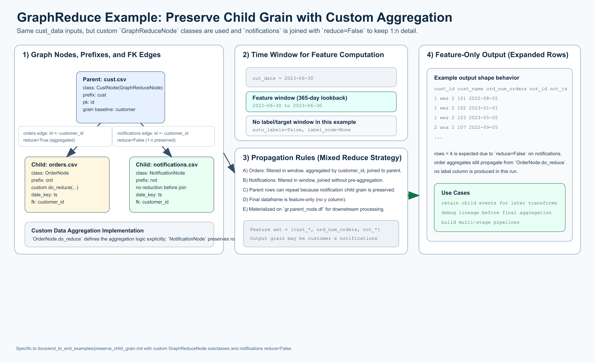

# Preserve Child Grain (`reduce=False`)

[](preserve_child_grain_overview.png)

Open full-size: [PNG](preserve_child_grain_overview.png) | [SVG](preserve_child_grain_overview.svg)

This diagram is intentionally parallel to the Hello World visual, but this
example is a **custom data aggregation implementation**: it uses
`GraphReduceNode` subclasses, an explicit `OrderNode.do_reduce(...)`, and a
`notifications` edge with `reduce=False` to preserve child 1:n grain.

This example also highlights the **pluggability of GraphReduce across multiple
backends** by showing the same graph semantics in both a `pandas backend` and a
`duckdb backend` (SQLNode-based execution).

This example uses the same sample data as Hello World but sets
`reduce=False` on the `notifications.csv` edge:

```python
gr.add_entity_edge(cust_node, notifications_node, parent_key="id", relation_key="customer_id", reduce=False)
```

The key effect is that notifications are not rolled up to one row per
customer before joining. That preserves the child 1:n grain at the parent join
point and expands output rows beyond pure parent grain.

## When To Use This Pattern

Use `reduce=False` when you want downstream logic to keep child-level records
instead of collapsing them into aggregated features immediately.

## pandas backend

This variant uses custom `GraphReduceNode` subclasses and explicit pandas
aggregation logic (`OrderNode.do_reduce(...)`).

```python
import datetime
from pathlib import Path

import pandas as pd

from graphreduce.node import GraphReduceNode
from graphreduce.graph_reduce import GraphReduce
from graphreduce.enum import ComputeLayerEnum, PeriodUnit

data_path = Path("tests/data/cust_data")

class CustNode(GraphReduceNode):
    def do_filters(self):
        return self.df

    def do_annotate(self):
        return self.df

    def do_post_join_annotate(self):
        return self.df

    def do_normalize(self):
        return self.df

    def do_post_join_filters(self):
        return self.df

    def do_reduce(self, reduce_key):
        return self.df

    def do_labels(self, reduce_key):
        return self.df


class OrderNode(GraphReduceNode):
    def do_filters(self):
        return self.df

    def do_annotate(self):
        return self.df

    def do_post_join_annotate(self):
        return self.df

    def do_normalize(self):
        return self.df

    def do_post_join_filters(self):
        return self.df

    def do_reduce(self, reduce_key):
        return self.prep_for_features().groupby(self.colabbr(reduce_key)).agg(
            **{
                self.colabbr("num_orders"): pd.NamedAgg(
                    column=self.colabbr(self.pk), aggfunc="count"
                )
            }
        ).reset_index()

    def do_labels(self, reduce_key):
        return self.df


class NotificationNode(GraphReduceNode):
    def do_filters(self):
        return self.df

    def do_annotate(self):
        return self.df

    def do_post_join_annotate(self):
        return self.df

    def do_normalize(self):
        return self.df

    def do_post_join_filters(self):
        return self.df

    def do_reduce(self, reduce_key):
        return self.df

    def do_labels(self, reduce_key):
        return self.df


cust_node = CustNode(
    fpath=str(data_path / "cust.csv"),
    fmt="csv",
    prefix="cust",
    date_key=None,
    pk="id",
    compute_layer=ComputeLayerEnum.pandas,
)

orders_node = OrderNode(
    fpath=str(data_path / "orders.csv"),
    fmt="csv",
    prefix="ord",
    date_key="ts",
    pk="id",
    compute_layer=ComputeLayerEnum.pandas,
)

notifications_node = NotificationNode(
    fpath=str(data_path / "notifications.csv"),
    fmt="csv",
    prefix="not",
    date_key="ts",
    pk="id",
    compute_layer=ComputeLayerEnum.pandas,
)

gr = GraphReduce(
    name="preserve_child_grain",
    parent_node=cust_node,
    fmt="csv",
    compute_layer=ComputeLayerEnum.pandas,
    auto_features=False,
    auto_labels=False,
    label_node=None,
    label_field=None,
    label_operation=None,
    cut_date=datetime.datetime(2023, 6, 30),
    compute_period_unit=PeriodUnit.day,
    compute_period_val=365,
    auto_feature_hops_back=3,
    auto_feature_hops_front=0,
)

gr.add_node(cust_node)
gr.add_node(orders_node)
gr.add_node(notifications_node)

# Orders are still reduced to customer grain.
gr.add_entity_edge(
    parent_node=cust_node,
    relation_node=orders_node,
    parent_key="id",
    relation_key="customer_id",
    relation_type="parent_child",
    reduce=True,
)

# Notifications are NOT reduced; child-level grain is preserved.
gr.add_entity_edge(
    parent_node=cust_node,
    relation_node=notifications_node,
    parent_key="id",
    relation_key="customer_id",
    relation_type="parent_child",
    reduce=False,
)

gr.do_transformations()

print("rows:", len(gr.parent_node.df))
print("columns:", len(gr.parent_node.df.columns))
print(gr.parent_node.df.head(10))
```

## duckdb backend

This variant uses SQL nodes on DuckDB with the same graph semantics:
`orders` uses custom reduction SQL, and `notifications` is joined with
`reduce=False` to preserve child-level rows.

```python
import datetime
from pathlib import Path

import duckdb

from graphreduce.node import DuckdbNode
from graphreduce.graph_reduce import GraphReduce
from graphreduce.enum import ComputeLayerEnum, PeriodUnit, SQLOpType
from graphreduce.models import sqlop

data_path = Path("tests/data/cust_data")
con = duckdb.connect()

cust_node = DuckdbNode(
    fpath=f"'{data_path / 'cust.csv'}'",
    prefix="cust",
    pk="id",
    columns=["id", "name"],
    table_name="customer",
)

orders_node = DuckdbNode(
    fpath=f"'{data_path / 'orders.csv'}'",
    prefix="ord",
    pk="id",
    date_key="ts",
    columns=["id", "customer_id", "ts", "amount"],
    table_name="orders",
    do_reduce_ops=[
        sqlop(optype=SQLOpType.agg, opval="ord_customer_id"),
        sqlop(optype=SQLOpType.aggfunc, opval="count(ord_id) as ord_num_orders"),
    ],
)

notifications_node = DuckdbNode(
    fpath=f"'{data_path / 'notifications.csv'}'",
    prefix="not",
    pk="id",
    date_key="ts",
    columns=["id", "customer_id", "ts"],
    table_name="notifications",
)

gr = GraphReduce(
    name="preserve_child_grain_duckdb",
    parent_node=cust_node,
    compute_layer=ComputeLayerEnum.duckdb,
    sql_client=con,
    auto_features=False,
    auto_labels=False,
    label_node=None,
    label_field=None,
    label_operation=None,
    cut_date=datetime.datetime(2023, 6, 30),
    compute_period_unit=PeriodUnit.day,
    compute_period_val=365,
)

gr.add_node(cust_node)
gr.add_node(orders_node)
gr.add_node(notifications_node)

gr.add_entity_edge(
    parent_node=cust_node,
    relation_node=orders_node,
    parent_key="id",
    relation_key="customer_id",
    reduce=True,
)

gr.add_entity_edge(
    parent_node=cust_node,
    relation_node=notifications_node,
    parent_key="id",
    relation_key="customer_id",
    reduce=False,
)

gr.do_transformations_sql()
out_df = con.sql(f"select * from {gr.parent_node._cur_data_ref}").to_df()

print("rows:", len(out_df))
print("columns:", len(out_df.columns))
print(out_df.head(10))

con.close()
```

## What To Expect

* No `y` column is generated because labels are disabled (`auto_labels=False`).
* The page includes both a `pandas backend` and a `duckdb backend`.
* `pandas backend` uses custom `GraphReduceNode` subclasses.
* `duckdb backend` uses `DuckdbNode` (a `SQLNode` implementation for DuckDB).
* Rows are typically greater than the number of parent rows (`cust.csv` has 4)
  because the non-reduced `notifications` edge preserves 1:n detail.
* You still get aggregated signal from reduced edges (here: `orders` via
  custom reduction logic) while preserving notification-level rows.

## Sample Data Files Used

* `tests/data/cust_data/cust.csv`
* `tests/data/cust_data/orders.csv`
* `tests/data/cust_data/notifications.csv`
