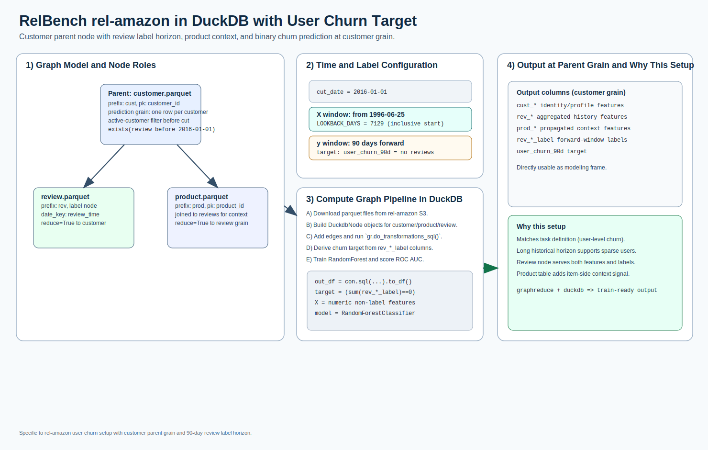

# rel-amazon: user churn

[](relbench_rel_amazon_user_churn_overview.svg)

Open full-size: [SVG](relbench_rel_amazon_user_churn_overview.svg)

This example implements the RelBench rel-amazon user churn setup:

* parent node: `customer.parquet`
* label node: `review.parquet`
* context node: `product.parquet`
* cut date: `2016-01-01`
* lookback start: `1996-06-25`
* label period: `90` days
* target: user churn (`1` if no review activity in next 90 days)

Data source:

* `https://open-relbench.s3.us-east-1.amazonaws.com/rel-amazon`

## Complete Example

### Data Preparation + GraphReduce

```python
from pathlib import Path
from urllib.request import urlretrieve

from relbench_amazon_common import (
    BASE_URL,
    TABLES,
    CUT_DATE,
    LOOKBACK_START,
    LOOKBACK_DAYS,
    LABEL_PERIOD_DAYS,
    run_amazon_task,
)

out_dir = Path("tests/data/relbench/rel-amazon")
out_dir.mkdir(parents=True, exist_ok=True)
for table in TABLES:
    path = out_dir / table
    if not path.exists():
        urlretrieve(f"{BASE_URL}/{table}", path)

df, auc, n_features, downloaded, target = run_amazon_task("user_churn", data_dir=out_dir)

print("cut_date:", CUT_DATE.date())
print("lookback_start:", LOOKBACK_START.date())
print("lookback_days:", LOOKBACK_DAYS)
print("label_period_days:", LABEL_PERIOD_DAYS)
print("target:", target)
print("rows:", len(df), "columns:", len(df.columns))
```

### Model Training

```python
import numpy as np
from catboost import CatBoostClassifier
from sklearn.metrics import roc_auc_score
from sklearn.model_selection import train_test_split

# target = user_churn_90d
numeric_cols = [c for c in df.select_dtypes(include=[np.number]).columns if c != "user_churn_90d"]
feature_cols = [
    c
    for c in numeric_cols
    if "label" not in c.lower() and not c.lower().endswith("_id") and c.lower() not in {"customerid", "productid"}
]

X = df[feature_cols].fillna(0)
y = df["user_churn_90d"]

X_train, X_test, y_train, y_test = train_test_split(
    X,
    y,
    test_size=0.2,
    stratify=y,
    random_state=42,
)

model = CatBoostClassifier(
    iterations=400,
    depth=8,
    learning_rate=0.05,
    loss_function="Logloss",
    eval_metric="AUC",
    random_seed=42,
    verbose=False,
    allow_writing_files=False,
)
model.fit(X_train, y_train)
auc = roc_auc_score(y_test, model.predict_proba(X_test)[:, 1])
print("roc_auc:", round(float(auc), 4))
```

Full runnable scripts:

* `examples/relbench_amazon_common.py`
* `examples/relbench_amazon_user_churn.py`
* `examples/relbench_amazon_user_churn_local_runner.py`

## Run Interactive

<div class="modal-runner" data-modal-runner data-api-base="https://runner.13.218.155.128.sslip.io" data-example="relbench_amazon_user_churn">
  <div class="modal-runner-controls">
    <input class="modal-runner-input" data-api-input value="https://runner.13.218.155.128.sslip.io" />
    <button data-save-api-btn>Save API URL</button>
    <button data-run-btn>Run rel-amazon User Churn</button>
  </div>
  <div class="modal-runner-status" data-status>Idle</div>
  <pre class="modal-runner-log" data-log></pre>
</div>
