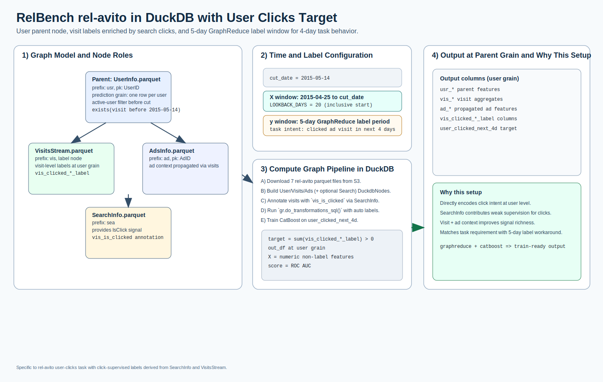

# rel-avito: user clicks (Classification)

[](relbench_rel_avito_user_clicks_overview.svg)

Open full-size: [SVG](relbench_rel_avito_user_clicks_overview.svg)

This example implements the RelBench rel-avito user-clicks setup with the
updated `SearchStream.parquet` label source.

* parent node: `UserInfo.parquet`
* label node: `SearchStream.parquet`
* label path: `UserInfo -> SearchInfo -> SearchStream` (2 joins from parent)
* click label aggregation: `sum(case when IsClick > 0 then 1 else 0 end)`
* target definition: user clicks on **more than 1 ad** in next 4 days
* GraphReduce label period: `5` days (`<` end boundary)
* cut date: `2015-05-14`
* lookback window: `2015-04-25` (inclusive) to cut date

Data source:

* `https://open-relbench.s3.us-east-1.amazonaws.com/rel-avito`

Tables used:

* `AdsInfo.parquet`
* `Category.parquet`
* `Location.parquet`
* `PhoneRequestsStream.parquet`
* `SearchInfo.parquet`
* `SearchStream.parquet`
* `UserInfo.parquet`
* `VisitsStream.parquet`

## Graph Design

The graph is configured as:

* `UserInfo -> VisitsStream`
* `UserInfo -> SearchInfo -> SearchStream` (label branch)
* `UserInfo -> PhoneRequestsStream`
* `VisitsStream -> AdsInfo`
* `SearchInfo -> AdsInfo`

`AdsInfo` is instantiated as two separate `DuckdbNode` objects (one per branch)
so each edge has its own node instance.

## Label Logic

`SearchStream` defines labels with SQL ops similar to:

```sql
sum(case when coalesce(try_cast(IsClick as double), 0) > 0 then 1 else 0 end)
count(distinct case when coalesce(try_cast(IsClick as double), 0) > 0 then AdID end)
```

Final binary target:

<details>
<summary>Show Code</summary>

```python
user_multi_click_next_4d = (distinct_clicked_ads > 1).astype("int8")
```

</details>

## Run Example

```bash
python examples/relbench_avito_user_clicks.py
```

## Run Interactive

<div class="modal-runner" data-modal-runner data-api-base="https://runner.13.218.155.128.sslip.io" data-example="relbench_avito_user_clicks">
  <div class="modal-runner-controls">
    <input class="modal-runner-input" data-api-input value="https://runner.13.218.155.128.sslip.io" />
    <button data-save-api-btn>Save API URL</button>
    <button data-run-btn>Run rel-avito User Clicks</button>
  </div>
  <div class="modal-runner-status" data-status>Idle</div>
  <pre class="modal-runner-log" data-log></pre>
</div>
