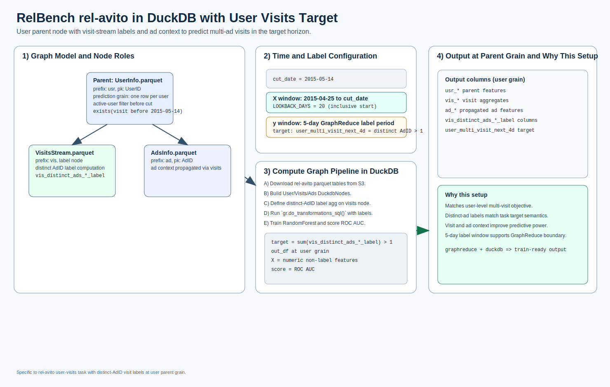

# rel-avito: user visits

[](relbench_rel_avito_user_visits_overview.svg)

Open full-size: [SVG](relbench_rel_avito_user_visits_overview.svg)

This example implements the RelBench rel-avito user-visits setup:

* parent node: `UserInfo.parquet`
* label node: `VisitsStream.parquet`
* context node: `AdsInfo.parquet`
* cut date: `2015-05-14`
* lookback window: `2015-04-25` (inclusive) to cut date
* target period: 4 days task horizon, implemented as `5` days in GraphReduce
* target: whether user visits more than one unique ad in target window
  * `count(distinct AdID) > 1`

Data source:

* `https://open-relbench.s3.us-east-1.amazonaws.com/rel-avito`

Tables used from the dataset:

* `AdsInfo.parquet`
* `Category.parquet`
* `Location.parquet`
* `PhoneRequestsStream.parquet`
* `SearchInfo.parquet`
* `UserInfo.parquet`
* `VisitsStream.parquet`

## Complete Example

### Data Preparation + GraphReduce

```python
from pathlib import Path
from urllib.request import urlretrieve

from relbench_avito_common import (
    BASE_URL,
    TABLES,
    CUT_DATE,
    LOOKBACK_START,
    LOOKBACK_DAYS,
    LABEL_PERIOD_DAYS,
    run_avito_task,
)

# Download data
out_dir = Path("tests/data/relbench/rel-avito")
out_dir.mkdir(parents=True, exist_ok=True)
for table in TABLES:
    path = out_dir / table
    if not path.exists():
        urlretrieve(f"{BASE_URL}/{table}", path)

# Build GraphReduce dataframe for user-visits
# (parent: UserInfo, label node: VisitsStream, label is distinct visited ads)
df, auc, n_features, downloaded, target = run_avito_task("user_visits", data_dir=out_dir)

print("cut_date:", CUT_DATE.date())
print("lookback_start:", LOOKBACK_START.date())
print("lookback_days:", LOOKBACK_DAYS)
print("label_period_days:", LABEL_PERIOD_DAYS)
print("target:", target)
print("rows:", len(df), "columns:", len(df.columns))
```

### Model Training

```python
import numpy as np
from catboost import CatBoostClassifier
from sklearn.metrics import roc_auc_score
from sklearn.model_selection import train_test_split

# target = user_multi_visit_next_4d
numeric_cols = [c for c in df.select_dtypes(include=[np.number]).columns if c != "user_multi_visit_next_4d"]
feature_cols = [
    c
    for c in numeric_cols
    if "label" not in c.lower() and not c.lower().endswith("_id") and "userid" not in c.lower()
]

X = df[feature_cols].fillna(0)
y = df["user_multi_visit_next_4d"]

X_train, X_test, y_train, y_test = train_test_split(
    X,
    y,
    test_size=0.2,
    stratify=y,
    random_state=42,
)

model = CatBoostClassifier(
    iterations=400,
    depth=8,
    learning_rate=0.05,
    loss_function="Logloss",
    eval_metric="AUC",
    random_seed=42,
    verbose=False,
    allow_writing_files=False,
)
model.fit(X_train, y_train)
auc = roc_auc_score(y_test, model.predict_proba(X_test)[:, 1])
print("roc_auc:", round(float(auc), 4))
```

Full runnable scripts:

* `examples/relbench_avito_common.py`
* `examples/relbench_avito_user_visits.py`
* `examples/relbench_avito_user_visits_local_runner.py`

## Run Interactive

<div class="modal-runner" data-modal-runner data-api-base="https://runner.13.218.155.128.sslip.io" data-example="relbench_avito_user_visits">
  <div class="modal-runner-controls">
    <input class="modal-runner-input" data-api-input value="https://runner.13.218.155.128.sslip.io" />
    <button data-save-api-btn>Save API URL</button>
    <button data-run-btn>Run rel-avito User Visits</button>
  </div>
  <div class="modal-runner-status" data-status>Idle</div>
  <pre class="modal-runner-log" data-log></pre>
</div>
