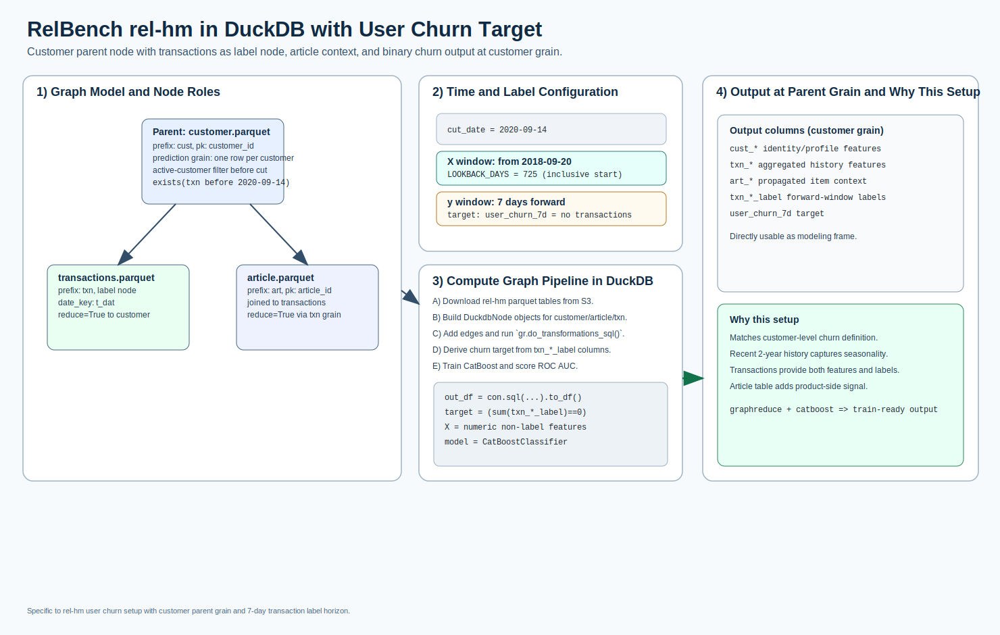

# rel-hm: user churn

[](relbench_rel_hm_user_churn_overview.svg)

Open full-size: [SVG](relbench_rel_hm_user_churn_overview.svg)

This example implements the RelBench rel-hm user churn setup:

* parent node: `customer.parquet`
* label node: `transactions.parquet`
* context node: `article.parquet`
* target: user churn (`1` if no transaction in next 7 days)
* cut date: `2020-09-14`
* lookback start: `2018-09-20` (`725` days)
* label period: `7` days

Data source:

* `https://open-relbench.s3.us-east-1.amazonaws.com/rel-hm`

## Complete Example

### Data Preparation + GraphReduce

```python
import datetime
from pathlib import Path
from urllib.request import urlretrieve

import duckdb

from graphreduce.enum import ComputeLayerEnum, PeriodUnit, SQLOpType
from graphreduce.graph_reduce import GraphReduce
from graphreduce.models import sqlop
from graphreduce.node import DuckdbNode

BASE_URL = "https://open-relbench.s3.us-east-1.amazonaws.com/rel-hm"
TABLES = ["article.parquet", "customer.parquet", "transactions.parquet"]

data_dir = Path("tests/data/relbench/rel-hm")
data_dir.mkdir(parents=True, exist_ok=True)
for table in TABLES:
    out_path = data_dir / table
    if not out_path.exists():
        urlretrieve(f"{BASE_URL}/{table}", out_path)

con = duckdb.connect()
con.sql(f"CREATE OR REPLACE VIEW article_src AS SELECT * FROM read_parquet('{data_dir / 'article.parquet'}')")
con.sql(f"CREATE OR REPLACE VIEW customer_src AS SELECT * FROM read_parquet('{data_dir / 'customer.parquet'}')")
con.sql(f"CREATE OR REPLACE VIEW transactions_src AS SELECT * FROM read_parquet('{data_dir / 'transactions.parquet'}')")

article_columns = con.sql("select * from article_src limit 0").to_df().columns.tolist()
customer_columns = con.sql("select * from customer_src limit 0").to_df().columns.tolist()
transaction_columns = con.sql("select * from transactions_src limit 0").to_df().columns.tolist()

cut_date = datetime.datetime(2020, 9, 14)
lookback_start = datetime.datetime(2018, 9, 20)
lookback_days = (cut_date - lookback_start).days

customer = DuckdbNode(
    fpath="customer_src",
    prefix="cust",
    pk="customer_id",
    date_key=None,
    columns=customer_columns,
    do_filters_ops=[
        sqlop(
            optype=SQLOpType.where,
            opval=(
                "exists (select 1 from transactions_src tx "
                "where tx.customer_id = cust_customer_id "
                f"and tx.t_dat < '{cut_date.date()}')"
            ),
        )
    ],
)

article = DuckdbNode(
    fpath="article_src",
    prefix="art",
    pk="article_id",
    date_key=None,
    columns=article_columns,
)

transactions = DuckdbNode(
    fpath="transactions_src",
    prefix="txn",
    pk="article_id",
    date_key="t_dat",
    columns=transaction_columns,
)

gr = GraphReduce(
    name="rel_hm_user_churn",
    parent_node=customer,
    compute_layer=ComputeLayerEnum.duckdb,
    sql_client=con,
    cut_date=cut_date,
    compute_period_val=lookback_days,
    compute_period_unit=PeriodUnit.day,
    auto_features=True,
    auto_labels=True,
    date_filters_on_agg=True,
    label_node=transactions,
    label_field="article_id",
    label_operation="count",
    label_period_val=7,
    label_period_unit=PeriodUnit.day,
    auto_feature_hops_back=3,
    auto_feature_hops_front=0,
)

for node in [customer, article, transactions]:
    gr.add_node(node)

gr.add_entity_edge(customer, transactions, parent_key="customer_id", relation_key="customer_id", reduce=True)
gr.add_entity_edge(transactions, article, parent_key="article_id", relation_key="article_id", reduce=True)

gr.do_transformations_sql()
out_df = con.sql(f"select * from {gr.parent_node._cur_data_ref}").to_df()

label_cols = [c for c in out_df.columns if c.startswith("txn_") and "label" in c.lower()]
for c in label_cols:
    out_df[c] = out_df[c].fillna(0)
out_df["user_churn_7d"] = (out_df[label_cols].sum(axis=1) == 0).astype("int8")
```

### Model Training

```python
import numpy as np
from catboost import CatBoostClassifier
from sklearn.metrics import roc_auc_score
from sklearn.model_selection import train_test_split

numeric_cols = [c for c in out_df.select_dtypes(include=[np.number]).columns if c != "user_churn_7d"]
feature_cols = [
    c
    for c in numeric_cols
    if "label" not in c.lower() and not c.lower().endswith("_id") and c not in {"cust_customer_id", "txn_article_id"}
]

X = out_df[feature_cols].fillna(0)
y = out_df["user_churn_7d"]

X_train, X_test, y_train, y_test = train_test_split(
    X,
    y,
    test_size=0.2,
    stratify=y,
    random_state=42,
)

model = CatBoostClassifier(
    iterations=400,
    depth=8,
    learning_rate=0.05,
    loss_function="Logloss",
    eval_metric="AUC",
    random_seed=42,
    verbose=False,
    allow_writing_files=False,
)
model.fit(X_train, y_train)
auc = roc_auc_score(y_test, model.predict_proba(X_test)[:, 1])
print("roc_auc:", round(float(auc), 4))
```

Full runnable scripts:

* `examples/relbench_hm_user_churn.py`
* `examples/relbench_hm_user_churn_local_runner.py`

## Run Interactive

<div class="modal-runner" data-modal-runner data-api-base="https://runner.13.218.155.128.sslip.io" data-example="relbench_hm_user_churn">
  <div class="modal-runner-controls">
    <input class="modal-runner-input" data-api-input value="https://runner.13.218.155.128.sslip.io" />
    <button data-save-api-btn>Save API URL</button>
    <button data-run-btn>Run rel-hm User Churn</button>
  </div>
  <div class="modal-runner-status" data-status>Idle</div>
  <pre class="modal-runner-log" data-log></pre>
</div>
