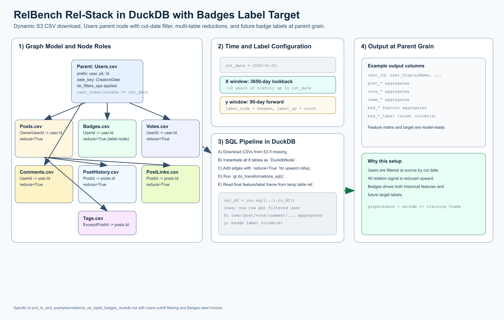

# RelBench Rel-Stack with DuckDB (Badges as Label)

[](relbench_rel_stack_badges_duckdb_overview.png)

Open full-size: [PNG](relbench_rel_stack_badges_duckdb_overview.png) | [SVG](relbench_rel_stack_badges_duckdb_overview.svg)

This example dynamically downloads the hosted
[RelBench `rel-stack` dataset](https://relbench.stanford.edu/datasets/rel-stack/#user-badge)
CSV files,
instantiates all tables as `DuckdbNode` objects, and predicts future
`Badges.csv` activity by using `Badges.csv` as the label node.

Hosted dataset root:
`https://open-relbench.s3.us-east-1.amazonaws.com/rel-stack`

Tables used:

* `Users.csv`
* `Posts.csv`
* `Badges.csv`
* `PostHistory.csv`
* `PostLinks.csv`
* `Votes.csv`
* `Comments.csv`
* `Tags.csv`

## Complete Example

### Data Preparation

```python
import datetime
from pathlib import Path
from urllib.request import urlretrieve

import duckdb

from graphreduce.graph_reduce import GraphReduce
from graphreduce.node import DuckdbNode
from graphreduce.enum import ComputeLayerEnum, PeriodUnit, SQLOpType
from graphreduce.models import sqlop

BASE_URL = "https://open-relbench.s3.us-east-1.amazonaws.com/rel-stack"
TABLES = [
    "Users.csv",
    "Posts.csv",
    "Badges.csv",
    "PostHistory.csv",
    "PostLinks.csv",
    "Votes.csv",
    "Comments.csv",
    "Tags.csv",
]

data_dir = Path("data/relbench/rel-stack")
data_dir.mkdir(parents=True, exist_ok=True)

# Download data dynamically (skip files that already exist).
for table in TABLES:
    out_path = data_dir / table
    if not out_path.exists():
        urlretrieve(f"{BASE_URL}/{table}", out_path)

con = duckdb.connect()
cut_date = datetime.datetime(2020, 1, 1)

user = DuckdbNode(
    fpath=f"'{data_dir / 'Users.csv'}'",
    prefix="user",
    pk="Id",
    date_key="CreationDate",
    columns=["Id", "DisplayName", "Location", "ProfileImageUrl", "WebsiteUrl", "AboutMe", "CreationDate"],
    table_name="users",
    do_filters_ops=[
        sqlop(
            optype=SQLOpType.where,
            opval=f"user_CreationDate <= '{cut_date.date()}'",
        )
    ],
)

post = DuckdbNode(
    fpath=f"'{data_dir / 'Posts.csv'}'",
    prefix="post",
    pk="Id",
    date_key="CreationDate",
    columns=["Id", "OwnerUserId", "PostTypeId", "AcceptedAnswerId", "ParentId", "Title", "Tags", "Body", "CreationDate"],
    table_name="posts",
)

badge = DuckdbNode(
    fpath=f"'{data_dir / 'Badges.csv'}'",
    prefix="bad",
    pk="Id",
    date_key="Date",
    columns=["Id", "UserId", "Class", "Name", "Date"],
    table_name="badges",
)

post_history = DuckdbNode(
    fpath=f"'{data_dir / 'PostHistory.csv'}'",
    prefix="ph",
    pk="Id",
    date_key="CreationDate",
    columns=["Id", "PostHistoryTypeId", "PostId", "RevisionGUID", "CreationDate", "UserId", "Text", "Comment", "ContentLicense"],
    table_name="post_history",
)

post_links = DuckdbNode(
    fpath=f"'{data_dir / 'PostLinks.csv'}'",
    prefix="plink",
    pk="Id",
    date_key="CreationDate",
    columns=["Id", "CreationDate", "PostId", "RelatedPostId", "LinkTypeId"],
    table_name="post_links",
)

vote = DuckdbNode(
    fpath=f"'{data_dir / 'Votes.csv'}'",
    prefix="vote",
    pk="Id",
    date_key="CreationDate",
    columns=["Id", "PostId", "VoteTypeId", "UserId", "CreationDate", "BountyAmount"],
    table_name="votes",
)

comment = DuckdbNode(
    fpath=f"'{data_dir / 'Comments.csv'}'",
    prefix="comm",
    pk="Id",
    date_key="CreationDate",
    columns=["Id", "PostId", "Score", "Text", "CreationDate", "UserId", "ContentLicense"],
    table_name="comments",
)

tag = DuckdbNode(
    fpath=f"'{data_dir / 'Tags.csv'}'",
    prefix="tag",
    pk="Id",
    date_key=None,
    columns=["Id", "TagName", "Count", "ExcerptPostId", "WikiPostId"],
    table_name="tags",
)

gr = GraphReduce(
    name="rel-stack-badges",
    parent_node=user,
    compute_layer=ComputeLayerEnum.duckdb,
    sql_client=con,
    cut_date=cut_date,
    compute_period_val=3650,
    compute_period_unit=PeriodUnit.day,
    auto_features=True,
    auto_labels=True,
    label_node=badge,
    label_field="Id",
    label_operation="count",
    label_period_val=90,
    label_period_unit=PeriodUnit.day,
    auto_feature_hops_back=4,
    auto_feature_hops_front=0,
)

for node in [user, post, badge, post_history, post_links, vote, comment, tag]:
    gr.add_node(node)

# User-centric rollups.
gr.add_entity_edge(parent_node=user, relation_node=post, parent_key="Id", relation_key="OwnerUserId", reduce=True)
gr.add_entity_edge(parent_node=user, relation_node=vote, parent_key="Id", relation_key="UserId", reduce=True)
gr.add_entity_edge(parent_node=user, relation_node=comment, parent_key="Id", relation_key="UserId", reduce=True)
gr.add_entity_edge(parent_node=user, relation_node=badge, parent_key="Id", relation_key="UserId", reduce=True)

# Post-centric rollups that propagate up via posts.
gr.add_entity_edge(parent_node=post, relation_node=post_history, parent_key="Id", relation_key="PostId", reduce=True)
gr.add_entity_edge(parent_node=post, relation_node=post_links, parent_key="Id", relation_key="PostId", reduce=True)
gr.add_entity_edge(parent_node=post, relation_node=vote, parent_key="Id", relation_key="PostId", reduce=True)
gr.add_entity_edge(parent_node=post, relation_node=comment, parent_key="Id", relation_key="PostId", reduce=True)
gr.add_entity_edge(parent_node=post, relation_node=tag, parent_key="Id", relation_key="ExcerptPostId", reduce=True)

gr.do_transformations_sql()

out_df = con.sql(f"select * from {gr.parent_node._cur_data_ref}").to_df()
print("rows:", len(out_df))
print("columns:", len(out_df.columns))
df = out_df.copy()

# Label columns are generated from the badge label node.
label_cols = [c for c in df.columns if c.startswith("bad_") and "label" in c.lower()]
print("label columns:", label_cols)
print(df.head())
```

### Model Training

```python
import numpy as np
from torch_frame.utils import infer_df_stype
from sklearn.model_selection import StratifiedKFold, train_test_split
from sklearn.metrics import roc_auc_score
from catboost import CatBoostClassifier, Pool

# Continue from `df` and `label_cols` produced in Data Preparation.
if not label_cols:
    raise ValueError("No badge label columns were found in df.")
target = label_cols[0]
df[target] = (df[target].fillna(0) > 0).astype("int8")

stypes = infer_df_stype(df)
features = [
    k
    for k, v in stypes.items()
    if str(v) == "numerical"
    and k not in ["user_Id", "user_AccountId"]
    and "label" not in k
    and "had_engagement" not in k
]
features = [c for c in features if c in df.columns]

# -------------------------------------------------
# 1. Split off the final test set (once)
# -------------------------------------------------
X_train_full, X_test, y_train_full, y_test = train_test_split(
    df[features],
    df[target],
    test_size=0.20,
    stratify=df[target],
    random_state=42,
)

# -------------------------------------------------
# 2. K-Fold CV on the remaining 80%
# -------------------------------------------------
k = 3
skf = StratifiedKFold(n_splits=k, shuffle=True, random_state=42)

fold_aucs = []
test_preds = np.zeros(len(X_test))
oof_preds = np.zeros(len(X_train_full))

# Optional pool creation.
train_pool = Pool(X_train_full, y_train_full)

for fold, (idx_tr, idx_va) in enumerate(skf.split(X_train_full, y_train_full), 1):
    print(f"\n=== Fold {fold} ===")

    X_tr, X_va = X_train_full.iloc[idx_tr], X_train_full.iloc[idx_va]
    y_tr, y_va = y_train_full.iloc[idx_tr], y_train_full.iloc[idx_va]

    mdl = CatBoostClassifier(
        loss_function="Logloss",
        eval_metric="AUC",
        custom_metric=["AUC", "PRAUC", "F1", "Recall", "Precision", "Logloss"],
        use_best_model=True,
        iterations=8000,
        learning_rate=0.02,
        depth=6,
        l2_leaf_reg=5.0,
        min_data_in_leaf=20,
        boosting_type="Ordered",
        auto_class_weights="Balanced",
        bootstrap_type="Bayesian",
        bagging_temperature=0.5,
        random_strength=0.8,
        rsm=0.8,
        feature_border_type="GreedyLogSum",
        od_type="Iter",
        od_wait=250,
        verbose=200,
    )

    mdl.fit(
        X_tr,
        y_tr,
        eval_set=(X_va, y_va),
        use_best_model=True,
        verbose=False,
    )

    val_pred = mdl.predict_proba(X_va)[:, 1]
    val_auc = roc_auc_score(y_va, val_pred)
    fold_aucs.append(val_auc)
    print(f"Fold {fold} validation AUC : {val_auc:.4f}")

    test_preds += mdl.predict_proba(X_test)[:, 1] / k
    oof_preds[idx_va] = val_pred

# -------------------------------------------------
# 3. Final metrics
# -------------------------------------------------
print("\n=== CV Summary ===")
print(f"Mean CV AUC : {np.mean(fold_aucs):.4f} ± {np.std(fold_aucs):.4f}")
print(f"Folds AUC   : {[f'{a:.4f}' for a in fold_aucs]}")

test_auc = roc_auc_score(y_test, test_preds)
print(f"\nFinal test AUC (averaged over {k} folds): {test_auc:.4f}")

# -------------------------------------------------
# 4. Optional refit on the full train split
# -------------------------------------------------
final_mdl = CatBoostClassifier(
    loss_function="Logloss",
    eval_metric="AUC",
    custom_metric=["AUC", "PRAUC", "F1", "Recall", "Precision", "Logloss"],
    iterations=int(mdl.best_iteration_ * 1.1),
    learning_rate=0.02,
    depth=6,
    l2_leaf_reg=5.0,
    min_data_in_leaf=20,
    boosting_type="Ordered",
    auto_class_weights="Balanced",
    bootstrap_type="Bayesian",
    bagging_temperature=0.5,
    random_strength=0.8,
    rsm=0.8,
    feature_border_type="GreedyLogSum",
    od_type="Iter",
    od_wait=250,
    verbose=200,
)

final_mdl.fit(X_train_full, y_train_full)
final_test_pred = final_mdl.predict_proba(X_test)[:, 1]
print("refit_test_auc:", round(roc_auc_score(y_test, final_test_pred), 4))

con.close()
```

## Notes

* This is a full DuckDB SQL graph execution (`gr.do_transformations_sql()`).
* All defined edges use `reduce=True` so signal is rolled up and propagated.
* `Badges.csv` is both:
  * a feature source (historical behavior in the feature window)
  * the label source (future behavior in the 90-day label window)

## Run Interactive

<div class="modal-runner" data-modal-runner data-api-base="https://runner.23.22.30.104.sslip.io" data-example="relbench_user_badges">
  <div class="modal-runner-controls">
    <input class="modal-runner-input" data-api-input value="https://runner.23.22.30.104.sslip.io" />
    <button data-save-api-btn>Save API URL</button>
    <button data-run-btn>Run rel-stack User Badges</button>
  </div>
  <div class="modal-runner-status" data-status>Idle</div>
  <pre class="modal-runner-log" data-log></pre>
</div>
