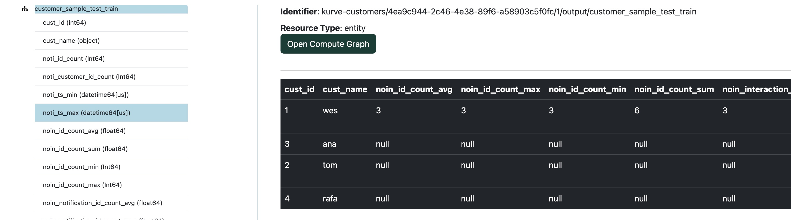

# Welcome to Kurve

Self-serve demo available at [https://demo.kurve.ai](https://demo.kurve.ai)

## Deployment
Kurve is deployed <b>into your environment behind your VPC</b> so no data ever leaves
your network.

### Metadata storage
The Kurve application is configured with `sqlite` by default but needs a relational database for the application-level models.  The metadata Kurve extracts and manages can also be optionally pushed directly into catalogs such as [Unity Catalog](https://www.unitycatalog.io).

### Authentication
Kurve supports basic auth and [OAuth 2.0](https://oauth.net/2/).  During a deployment, since Kurve runs within your cloud, there may be a manual configuration of the internal callback URL.

An example might be a VPC-protected internal subdomain: `CUSTOMER.kurve.dev/callback`

## Metadata extraction and inference
Kurve providers a number of algorithms that point at data catalogs
and infers the relational structure.
The metadata Kurve automatically extracts are the following:

### Per table
1. primary key
2. date key
3. row count

### Per table pair
1. join keys (if any)
2. cardinality

## Metadata graphs
Kurve metadata graphs use graph data structures, powered by [networkx](https://networkx.org) under the hood,
to represent tables as nodes and relationships between tables as edges.  This allows us to benefit from
the whole field of graph theory and take advantage of the rich ecosystem around it.

## Compute graphs
Metadata graphs are combined with compute graphs to run multi-table data integration.  Since the metadata
are repesented in a graph it allows us to perform [depth first search/traversal](https://en.wikipedia.org/wiki/Depth-first_search) based on [cardinality](https://en.wikipedia.org/wiki/Cardinality_(data_modeling)) to
integrate and aggregate data in a bottom up way (start at the high row count fact tables and aggregate upward).

## Quickstart demo
1. Create an account on [demo.kurve.ai](https://demo.kurve.ai)
2. Build a metadata graph on the sample data source `/usr/local/lake/cust_data`.
    - this will infer the primary keys, date keys, and foreign keys between the tables

    

3. Inspect the metadata graph to confirm the relationships are correct.
    - if there are incorrect relationships you can easily remove them
    
    - if edges were missed they can be added

    

4. Build a compute graph with the `cust.csv` as the <b>parent node</b> using the following parameters:
    1. name: customer sample test
    2. parent node: `cust.csv`
    3. depth limit: 2
    4. compute period in days: 365
    5. cut date: 5/1/2023
    6. label period in days: 60
    7. label node: `orders.csv`
    8. label field: `id`
    9. label operation: count

    

5. You should now see a compute graph with the `cust.csv` at the top and the `orders.csv` colored yellow since it is the target node.
6. In the compute graph viewier click on <b>Actions</b> and then <b>Execute</b>
7. Navigate to the home screen and you should see a data source under <b>My data sources</b>
8. Click on the data source and then click on the table name that was created which should
   be the lower cased and underscore separated name you used for the compute graph.
    

### What just happened?
1. The parent node indicates which table everything will be integrated to, in this case the `cust.csv`.

2. The depth limit indicates how many joins away from the parent node are permissible, in this case tables within 2 joins are included.

3. The cut date is the date around which to filter - so nothing after the cut date will be included in the data aggregation / integration process.

4. The compute period indicates how far backwards relative to the cut date to look in all of the tables.

5. The label period in days is how many days <i>after</i> the cut date to look for computing the label.

6. The label node is the table to run the label generation operation on.

7. The label field is the field in the label node to run the operation on.

8. The label operation is the actual operation to run, in this case count.

9. The execution does a depth first traversal through the graph, starting at the bottom and working it's way up to the parent node.  Each step of the way it applies date filters based on the <b>cut date</b> and performs aggregations prior to joining.  We'll dig more into how this works and how to customze compute graphs in the tutorial.
